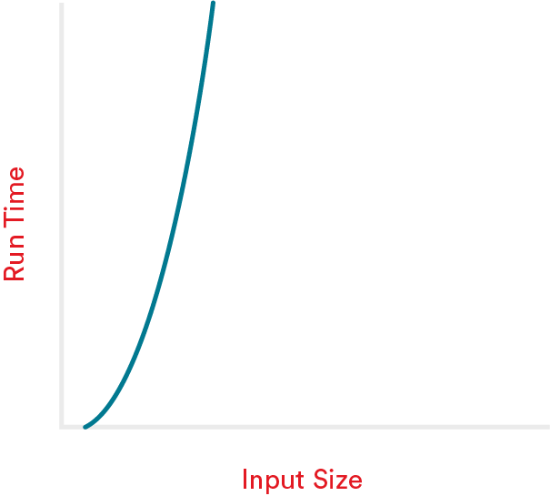

# Big O Notation

Learning about Big O Notation will teach you how to talk about the efficiency of algorithms — that is, how much time and space they need to run — like a computer science veteran. Want to learn how to casually drop “logarithmic complexity” into conversation? Read on!

- Efficiency in Coding
- Speaking Big O
- Big O Classifications

# Learning Objectives

1 of 22

By the end of this lesson, you'll be able to:

- Explain how Big O notation is used to describe algorithms.
- Define constant, linear, quadratic, logarithmic, and factorial Big O runtimes.
- Analyze algorithms to determine their Big O runtime.

# Understanding the “Worst-Case Scenario”

2 of 22

Let’s look at our car example again: You’ve bought your dream car and immediately take it out for a joy ride — an extended joy ride. You look at your fuel meter and discover you’re down to your last gallon of gas.

The car dealer had told you that your car gets about 18 miles per gallon. You ask Siri where the nearest gas station is, and she tells you it’s 15 miles away. That’s cutting it awfully close, wouldn’t you say?

Here’s what might be running through your head:

- “In the best-case scenario, could you get 20 miles per gallon instead of 18?”
- “What is the best-case scenario (average driving speed, type of road, etc.)?”
- “What if that last gallon of gas can only get you 14 more miles based on the type of road you’re on now?”

We would describe that last bullet as the worst-case scenario.

# Inefficiency in Coding: The “Worst-Case Scenario”

3 of 22

In coding, we use the idea of the “worst-case scenario” to compare the efficiency of different algorithms. That way, we know the code will never perform worse — i.e., slower, using up more RAM — than that measurement.

Knowing the best- or average-case performance of an algorithm is useful, too. But worst-case scenario is the standard measure for comparison. (If only car dealers made it that clear!)

# Big O Notation

4 of 22

When it comes to software, we talk about efficiency in terms of Big O notation. Big O comes from the world of math, where it’s used to describe the relationship between two functions based on their growth rates.

In software development, Big O focuses on the efficiency of an algorithm as its input increases. It’s used to describe time complexity or space complexity:

- **Time complexity** refers to the amount of time an algorithm takes to run.
- **Space complexity** refers to the amount of memory or RAM an algorithm needs to run.

Time complexity is a bit more complicated than space complexity, so let’s take a moment to dive into it.

# Measuring Time Complexity

5 of 22

Time complexity, or the amount of time an algorithm takes to run, is not actually measured in increments of time (e.g., seconds, minutes). Instead, we measure time based on the number of basic steps an algorithm needs to execute, relative to the size of the data set it’s working on.

While those steps may look different depending on the context or programming language, something like indexing into an array or adding two numbers together each count as one basic step in Big O.

Likewise, we’re not trying to calculate the exact number of steps a given algorithm takes. Big O isn’t about the nitty-gritty details. Instead, it’s a big-picture view of algorithms. It categorizes, at a high level, the differences between them.

If this sounds theoretical, it can actually have a pretty big effect on how you build programs and deliver them to users. Take a look!

# Let’s Talk Big O (The Informal Version)

6 of 22

(video)
Before we get into the technical classes of algorithmic complexity, let’s get familiar with the informal categories we’ll see, using our car analogy once again.

The best, highly efficient algorithms are those zippy little cars that get great gas mileage. They execute in the same amount of time or with the same amount of RAM, no matter the size of the input. Or, they increase a bit as the input increases,1 but then level off.

Pretty good algorithms are your mid-size cars or station wagons. They execute in an amount of time that’s directly proportional to the size of the input. If an input size of 10 elements has an execution time of five seconds, an input of 20 elements has an execution time of 10 seconds.

Inefficient algorithms, on the other hand, have execution time that increases exponentially — or more — as the input increases. They’re your giant, gas-guzzling trucks. Inefficient algorithms vary widely in terms of just how inefficient they can be, but they’re all pretty undesirable compared to the other two groups of algorithms.

# Let’s Talk Big O (The Technical Version)

7 of 22

OK, now you know how to describe efficiency in basic terms. Now it’s time to get more technical.

In the rest of the lesson, we’ll cover five classes of complexity in algorithms; in other words, break down the “highly efficient,” “pretty good,” and “inefficient” groups that we just discussed. Here they are:

|    Highly Efficient    |    Pretty Good    |     Inefficient      |
| :--------------------: | :---------------: | :------------------: |
|  Constant complexity   | Linear complexity | Quadratic complexity |
| Logarithmic complexity |                   | Factorial complexity |

# Constant Complexity: A Highly Efficient Algorithm

8 of 22

Constant complexity algorithms fall into the “highly efficient” category. They have a constant space (memory usage) and time (number of steps required) complexity, no matter the size of the input.

To understand this type of algorithm, imagine you’re throwing a bag of apples in the trash. This task will always take the same amount of time, no matter if you have 2 or 20 apples in that bag.

In Big O notation, we represent constant complexity algorithms as `O(1)`.

On the next slide, we’ll explore two examples of how constant complexity appears in code. As you look at the code, remember: The function will run once, no matter the size of the input. That’s how we get the `O(1)` notation.

# Constant Complexity in Code

9 of 22

### Example 1

```js
function helloWorld {
    console.log('hello world')
}
```

### Example 2

```js
let people = {
    instructor: "jimmy",
    student: "doug",
    boss: "shanaz"
}
people.instructor
=> "jimmy"
```

# Linear Complexity: An Algorithm With Pretty Good Efficiency

10 of 22

Linear complexity is represented as `O(N)` in Big O notation. For this type of algorithm, as the input size increases, the processing time increases linearly (one extra input = one more step for the code to perform).

The `(N)` notation represents just that — the code will run once for every input value.

Remember our apples analogy? This time, instead of throwing out your apples, you decide to peel them to make apple sauce. This is a linear task. The amount of time it’ll take you to peel all of the apples is directly proportional to the number of apples you have in the bag.

The next slide has some examples of `O(N)` in code. In each function, we go through the array and perform an action with each item in it. If we have `arr[1]`, the code will execute once. If we have the array `arr[3, 5, 100]`, the code will run three times. If our array has 1,000 items, the code will execute 1,000 times!

# Linear Complexity in Code

11 of 22

### Example 1

```js
function iterate(arr) {
  arr.forEach((item) => console.log(item));
}
```

### Example 2

```js
function iterateLoop(arr) {
  for (let i = 0; i < arr.length; i++) {
    console.log(arr[i]);
  }
}
```

# Knowledge Check

12 of 22

In 2009, an IT company in South Africa was frustrated by its slow internet speed. One employee complained, “It would be faster to transmit our data by carrier pigeon than over the internet!” The company chose to test this claim publicly.

For the test, the company set out to transmit their data from one facility to another — a total of 60 miles. A carrier pigeon delivered a flash drive containing the data while, at the same time, the company transmitted the same data through its broadband internet.

The carrier pigeon won (nature: 1, technology: 0).

How would you represent the speed of the pigeon and the broadband using Big O?

The pigeon is O(1) and the internet is O(N).

**Answer:**
No matter how much data the flash drive contains, the pigeon will always take about the same amount of time to complete the task, which is O(1). The speed at which it takes to transfer the data through the internetm however, greatly depends on how much data is being transferred. The more data, the longer it will take, which is O(N)

# Quadratic Complexity: An Inefficient Algorithm

13 of 22

For an input with the size `N`, quadratically complex algorithms execute `N\*N` times, giving us the Big O notation for this class: `O(N^2)`.

Put another way, these algorithms may have a nested loop, like in this example:

```js
function consoleLogLots(arr) {
  for (let i = 0; i < arr.length; i++) {
    for (let j = 0; j < arr.length; j++) {
      console.log(arr[i], arr[j]);
    }
  }
}
```

To imagine counting the number of steps, consider that each iteration through the outer loop counts as one basic step per input element. Next, in the inner loop, there is a basic step for each input element, but the inner loop runs from beginning to end for each iteration of the outer loop. We can multiply the number of steps taken in the inner loop by the number of iterations in the outer loop — `N*N` — or just `N^2`, the conventional notation for this function.

# Quadratic Complexity in Code

14 of 22

Looking at our nested loop function...

```js
function consoleLogLots(arr) {
  for (let i = 0; i < arr.length; i++) {
    for (let j = 0; j < arr.length; j++) {
      console.log(arr[i], arr[j]);
    }
  }
}
```

...for `arr[1, 3]`, this function will print:

```js
[1, 1][(1, 3)][(3, 1)][(3, 3)];
```

For a two-item array, the code executes four times. This scales pretty fast — for an array with 100 items, this code will `console.log()` 10,000 times!

Quadratically complex equations are very inefficient and should be avoided whenever possible.

# Logarithmic Complexity: A Highly Efficient Algorithm

15 of 22

Logarithmic complexity is represented as `O(log(N)).`

This type of algorithm cuts the problem in half each time. This makes them fast and efficient! And, despite their name, we don’t actually have to calculate logarithms, which is great news.

Imagine flipping through a phone book to find someone’s number. You could start at the beginning of the phone book and read every name on every page until it found the one you’re looking for. Sounds awful, right? That’s a linear `O(N)` algorithmic approach.

Instead of reading every single name, it's much easier to read one random name and flip forward or backward depending on how close that name is to the name you’re looking for. This approach is a logarithmic `O(log(N))` method. Much faster!

# Logarithmic Complexity in Code

16 of 22

This phone book example is an illustration of binary search, which is a classic `O(log(N)) `algorithm. In an unsorted array, if we want to find the index of an item with a given value, we have to iterate through it and check if each item is equal to the item we are searching for. However, if we know that we have a sorted array, we can do this a lot more easily!

We’ll spend a lot more time with this algorithm soon, but as a sneak preview, here’s the binary search algorithm:

```js
function binarySearch(arr, item, first = 0, last = null) {
  if (!last) last = arr.length;
  let midpoint = Math.floor((last - first) / 2) + first;
  if (arr[midpoint] === item) return midpoint;
  if (arr[midpoint] > item) return binarySearch(arr, item, first, midpoint);
  if (arr[midpoint] < item) return binarySearch(arr, item, midpoint, last);
}
```

Let’s say we want to find the value `5` in `arr[1, 3, 5, 7, 9, 11, 13]`. The function above would run three times instead of the seven that we would need if we iterated through the entire array!

This logarithmic algorithm is super efficient, because even if we have a million items in our array, on average we will only need to execute the binary search 20 times.

# Factorial Complexity: An Inefficient Algorithm

17 of 22

Factorial complexity, represented as `O(N!)`, should be avoided at all costs. Here’s why.

One example of an `O(N!)` algorithm is the “bogosort” — aka, the “slow sort.” Why so slow? An array is randomly ordered over and over again until it is correctly sorted. For an array with a length of `10`, this sort may have to run up to 3,628,800 times!

Sometimes this complexity category can’t be avoided, but it should raise some red flags.

# Comparing Complexity Classes

18 of 22

Let’s compare the runtimes of the five classes of complexity we covered for a variety of increasing inputs:

| **Input (N)** | O(1) | O(N) | O(N^2)  | O(log(N)) |   O(N!)   |
| :-----------: | :--: | :--: | :-----: | :-------: | :-------: |
|     **1**     |  1   |  1   |    1    |     1     |     1     |
|    **10**     |  1   |  10  |   100   |     3     | 3,628,800 |
|    **40**     |  1   |  40  |  1,600  |     5     | 8.16e+47  |
|    **80**     |  1   |  80  |  6,400  |     6     |    80!    |
|      600      |  1   | 600  | 360,000 |     9     |   600!    |

# Visualizing the Difference

19 of 22

### Constant Complexity: O(1)


### Linear Complexity: O(N)


### Quadratic Complexity: O(N^2)


### Logarithmic Complexity: O(log(N))


### Factorial Complexity: O(N!)



# Drop the Coefficients Like They’re Hot

20 of 22

Recall that Big O is a relatively high-level way to categorize algorithms. We’re not getting into the nitty-gritty of precisely how much time it takes for an algorithm to run, but instead, looking at its overall efficiency as an input size increases.

For this reason, it’s conventional in Big O to drop coefficients, constants, and other less significant terms when describing an algorithm’s complexity. We’re less worried about the exact runtime of an algorithm and more about the broad category into which it falls (linear complexity, quadratic complexity, etc.).

Take a look at these functions:

**Example 1:**

```js
function iter(arr) {
  // Big-O: N
  arr.forEach((item) => console.log(item));
  arr.forEach((item) => console.log(item));
  console.log('hello world');
}
```

**Example 2:**

```js
function helloWorld() {
  // Big-O: 1
  console.log('hello world');
  console.log('hello world');
}
```

At first glance, you might think they have complexities of `O(2N + 1)` and `O(2)`, respectively. However, in order to keep things simple, we can drop the coefficients. The time complexities are still linear and constant — and that’s all that matters for Big O!

# Let’s Talk About Interviews

21 of 22

Big O is a popular technical interview subject because of just how fundamental it is to the way that we talk about algorithms. Interviewers want to make sure that you understand the difference between efficiency and inefficiency so that you aren’t writing code that takes excessive memory or energy to run.

You could be asked to look at an algorithm, determine its Big O complexity, and give your reasoning. If so, keep the following considerations in mind:

- Does the function have to go through an entire list? If so, there’s an `N` in that Big O class somewhere.
- Are there nested loops? That might give you `O(N^2)` (or worse).
- Does the function break the list into smaller chunks? You could have `O(log(N))`.
- Is the amount of work the same, regardless of the size of the data set? You might have `O(1)`.

You could also be asked to describe how a given function could be rewritten more efficiently. As you’ve probably realized, most functions can be written in multiple ways. Big O helps you understand the most efficient way to write functions.

# Big O Notation Review

22 of 22
In this lesson, we learned about how Big O notation is used to categorize algorithms based on their time complexity (i.e., the time it takes an algorithm to run) and their space complexity (i.e., the space an algorithm requires to run). We also learned about five common classes of complexity:

- Constant complexity: `O(1)`.
- Linear complexity: `O(N)`.
- Quadratic complexity: `O(N^2)`.
- Logarithmic complexity: `O(log(N))`.
- Factorial complexity: `O(N!)`.

Big O is a vitally important concept for talking about algorithms. Check out the Big O Cheat Sheet, which lists the complexities of common algorithms and data structures. Know it, love it, bookmark it in your browser.

[Big O Cheat Sheet](https://www.bigocheatsheet.com/)
