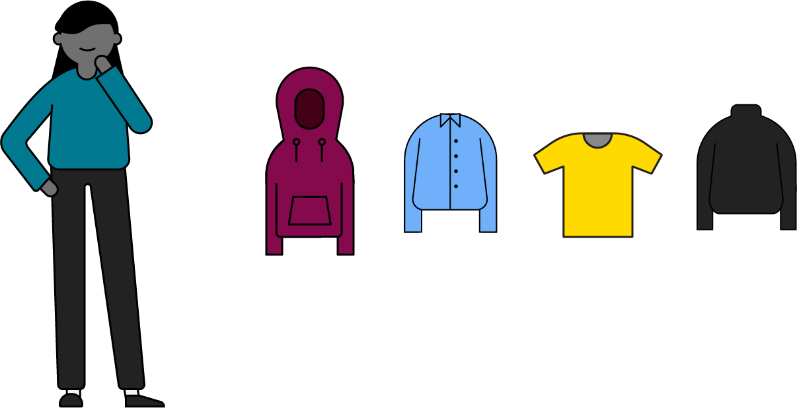

# Introduction to Sorting Algorithms

If you think sorting sounds simple, consider things you’ve had to sort before: your laundry, your taxes, your life... easier said than done, right? The same applies with sorting in programming. In this lesson, we’ll walk through some basic concepts and establish a foundation for learning more complicated sorting algorithms. (Just don’t expect us to help you sort your laundry.)

### TOPICS

- How to Sort
- Stability in Sorting
- Big O for Sorting

# Learning Objectives

1 of 17

By the end of this lesson, you'll be able to:

- Define the two sorting methods and when you’d use each.
- Identify whether a sort is stable or unstable and what impact that can have.
- Explain how Big O complexity applies to sorting algorithms.

# What Is Sorting?

2 of 17

(video)

Sorting in computer science is no different than sorting in real life. It’s taking an unordered collection of stuff, like this pile of Legos, and putting them into an ordered collection of stuff, like these Legos here.

Sorting is the foundation for much more complex algorithms. Do you want to manage customer accounts on your eCommerce site? Search a database for information? Schedule computing jobs to minimize completion time? Behind all of these important processes is a solid sorting algorithm.

If the only thing we’re trying to accomplish is putting things in order, how many sorting algorithms could there be? Surely it can’t be that complicated! You’d be surprised. There are dozens of sorting algorithms! There’s:

- bubble sort
- merge sort
- quick sort
- heap sort
- radix sort
- cube sort
- bucket sort
- shell sort
- tree sort
- insertion sort
- selection sort
- counting sort

And those are just the more common ones!

Each sort we’ll cover has its advantages and disadvantages. It’s important for us to understand why some sorts are bad before we can improve them. As you’ll discover, some of the most intuitive ways to sort are actually pretty terrible!

# Types of Sorting: Comparison Sort

3 of 17

There are two major types of sorting algorithms. The first we’ll cover is **comparison sort**. It does what it says on the tin: It compares two items and decides which one to put first.

If you’re comparing numbers, use their values. If you’re comparing words, use the alphabet. If you’re comparing Lego blocks, use their size, like below.


# Types of Sorting: Distribution Sort

4 of 17

Instead of comparing two items, distribution sort uses some property of the item itself to decide where it fits. Most of the time, this means dividing the items into groups based on some characteristic of the data itself. With our Lego blocks, this could mean grouping them by color.

Comparison and distribution sort aren’t better or worse than one another. They simply function differently, which means that they’re better suited for different types of data sets.


#

Knowledge Check
It’s time to clean out your closet and donate some old clothes to a thrift store. The thrift store takes in items based on the time of year, so you’re sorting your clothes by season (winter, spring, summer, fall).

What sorting method are you using here?



- [ ] Comparison sort
- [x] Distibution sort

**CORRECT:** In this instance, you're grouping items into categories of similar things rather than comparing each individual item to rhe next. That's a distribution sort. If you were to sort all of your T-shirts from oldest to newest, you might use a comparison sort.

# Stability

6 of 17

(video)

Before we go too much further, let’s discuss one important characteristic of sorting: stability. Stability preserves the initial order of a collection. It allows you to sort by one factor, and then by another, without the second sort screwing up the first one.

Let’s say you want to sort these cards numerically. Here’s what you’d get.

Next, you want to sort them by number AND by suit. If you used an unstable sort, your cards would end up looking like this. Sure, the cards are in order by suit, but you’ve lost the numerical ordering.

But if you use a stable sort, you can keep the numerical ordering when you sort by suit next. Much better!

Some sorting algorithms are stable while others aren’t. If your data set needs to be sorted based on two factors, you need to make sure the sort you’re using is stable. When we learn about individual sorting algorithms later on, you’ll find out which are stable or unstable sorts.

# Knowledge Check

7 of 17

Imagine that you’re running a programming contest. Everyone competes to answer 10 questions in one hour. Winners are determined first by how many problems they were able to solve. In the case of a tie, they’re next judged on how long it took them to finish the problems.

Here are the results sorted by time:

```js
programmers = [
  { solved: 8, minutes: 23 },
  { solved: 6, minutes: 27 },
  { solved: 2, minutes: 28 },
  { solved: 6, minutes: 35 },
  { solved: 6, minutes: 43 },
];
```

You then created this sort to determine the second-place winner:

```js
programmers = [
  { solved: 8, minutes: 23 },
  { solved: 6, minutes: 35 },
  { solved: 6, minutes: 27 },
  { solved: 6, minutes: 43 },
  { solved: 2, minutes: 28 },
];
```

Is this sort stable or unstable?

**ANSWER:**
Unstable - When we sorted the second time, we lost the relationship between the correct number of problems solved and time spent. Whoops! There might be some unhappy programmers after this...

# Algorithms in Time and Space

8 of 17

Remember Big O notation? We can compare sorting algorithms using Big O.

With Big O, we can describe the time and space complexities of algorithms. Recall that, in software development, Big O focuses on the efficiency of an algorithm as its input increases:

- **Time complexity** refers to the amount of time an algorithm takes to run.
- **Space complexity** refers to the amount of memory or RAM an algorithm needs to run.

Both values look at the “worst-case scenario” of these measures; that is, the maximum amount of time it could take for your algorithm to run or the maximum amount of space it would require.

(Does it seem like we’ve been here before? You’re correct! But Big O is so important in terms of talking about algorithms that we’ll keep bringing it up.)

# Looking at Time Complexity

9 of 17

Big O is used to estimate how many calculations you will need to perform, described by the “worst-case scenario.”

The `N` variable is the size of the input, or more plainly, the number of items being sorted. As we move from left to right across the table, we’re moving from very efficient runtimes like `O(1)` and `O(log(N))` to extremely inefficient runtimes like O`(N!)`. Stay away from the ones on the right!

| **Input (N)** | O(1) | O(N) | O(N^2)  | O(log(N)) |   O(N!)   |
| :-----------: | :--: | :--: | :-----: | :-------: | :-------: |
|     **1**     |  1   |  1   |    1    |     1     |     1     |
|    **10**     |  1   |  10  |   100   |     3     | 3,628,800 |
|    **40**     |  1   |  40  |  1,600  |     5     | 8.16e+47  |
|    **80**     |  1   |  80  |  6,400  |     6     |    80!    |
|      600      |  1   | 600  | 360,000 |     9     |   600!    |

# Looking at Space Complexity

10 of 17

When we measure space complexity, we are measuring how much extra space our algorithm requires as a function of the input.

Space complexity is described in one of two formats: **in place** or **out of place**.

| **Type**         | **Big O Complexity**  | **Description**                                                                            |
| ---------------- | --------------------- | ------------------------------------------------------------------------------------------ |
| **In place**     | `O(1)` or `(Olog(N))` | The space the algorithm takes is predictable and does not depend on the size of the input. |
| **Out of place** | `O(N)` or `O(N^2)`    | The algorithm uses an extra array, or more, into which to sort the values.                 |

# Knowledge Check

11 of 17

Time for a review!

Of the four types below, which class of complexity is the least efficient?

Select the best answer.

- [ ] `O(1)`
- [ ] `O(N)`
- [ ] `O(Log(N))`
- [x] `O(N^2)`

Quadratic complexity algorithms are the least efficient. If you have a data set with `N` items, you'll perform an operation `N^N` times. Not good!

# The Worst, The Best, and The Average

12 of 17

If talking about things based on the worst case sounds pessimistic, don’t despair! While worst case, Big O, is the most common way to compare algorithms, we also discuss their best and average cases, too!

### The Best Case

An algorithm’s best-case performance is called its “Big Omega,” or `Ω` (that’s the Greek symbol for Omega). Big Omega describes how fast an algorithm would run if it performed the fewest possible actions on a data set. If you were sorting an already sorted set, you’d get the Big Omega value.

### The Average Case

An algorithm’s average-case performance is called its “Big Theta,” or `Θ` (another Greek symbol). Big Theta describes the typical runtime of an algorithm.

Check out how different algorithms perform relative to one other on the next slide. There’s no need to watch the entire video, but check out as much as you want in order to get a feel for the different algorithm speeds. (Warning: There are lots of moving colors and fast speeds in this video. If that isn’t your thing, check out this [static version](https://www.toptal.com/developers/sorting-algorithms).)


# Time and Space, Visualized

13 of 17

[Visualization and Comparison of Sorting Algorithms](https://www.youtube.com/watch?v=ZZuD6iUe3Pc)

No words, just algorithmic glory.

# Other Considerations

14 of 17

Understanding a sorting algorithm’s time and space complexities helps us understand which algorithms to use when.

In addition to time and space complexity, there are a few other factors to think about when choosing a sort:

- **Stability** (whether or not the items in the set stay in order).
- **Sorting method** (comparison, distribution, or a combination of the two).
- The **size** and **structure** of your data (sorted, unsorted, very large, etc.).

# OK, Where’s the Cheat Sheet?!

15 of 17

We’ve got you.

You may not recognize all of these sorts, and that’s OK, because we’ll get to them soon. However, keep these comparisons in mind as you learn about each of them in the lessons that follow.

| Sort               | **Best Case** | **Average Case** | **Worst Case** | **Space**   | **Stability** | **Sorting Method** |
| ------------------ | ------------- | ---------------- | -------------- | ----------- | ------------- | ------------------ |
| **Bubble sort**    | `Ω(N)`        | `Θ(N^2)`         | `O(N^2)`       | `O(1)`      | Stable        | Comparison         |
| **Insertion sort** | `Ω(N)`        | `Θ(N^2)`         | `O(N^2)`       | `O(1)`      | Stable        | Comparison         |
| **Bucket sort**    | `Ω(N+K)`      | `Θ(N+K)`         | `O(N^2)`       | `O(N+K)`    | Stable        | Distribution       |
| **Radix sort**     | `Ω(NK)`       | `Θ(NK)`          | `O(NK)`        | `O(N+K)`    | Stable        | Distribution       |
| **Merge sort**     | `Ω(log(N))`   | `Θ(log(N))`      | `O(log(N))`    | `O(N)`      | Stable        | Comparison         |
| **Quick sort**     | `Ω(log(N))`   | `Θ(log(N))`      | `O(N^2)`       | `O(log(N))` | Unstable      | Comparison         |

# The Perfect Sort Doesn’t Exi...

16 of 17

Your next question might be, “Can’t you just tell me which sorting algorithm is best and teach me that one?”

Unfortunately, the perfect sort — the one sort to rule them all — doesn’t exist. While there are a few choice sorts you should get familiar with, there isn’t one “best” algorithm, because different sorts are good at different things.

Based on your needs for a specific situation, you’ll want to consider time complexity, space complexity, stability, and the kind of mechanism the algorithm uses to sort.

# Introduction to Sorting Algorithms Review

17 of 17

In this lesson, we explored some basic sorting concepts:

- **Comparison sorts** (comparing one value to another) versus **distribution sorts** (groupings items by a characteristic).
- **Stability:** If a data set remains in place when it’s sorted multiple times.

In the next set of lessons, we’ll learn about six important sorting algorithms:

- Bubble sort
- Insertion sort
- Merge sort
- Quick sort
- Bucket sort
- Radix sort

We’ll dive into how those specific algorithms show up in interviews soon. For now, check out the types of [sorting algorithm questions](https://www.techiedelight.com/sorting-interview-questions/) you might encounter.

### TOPICS

- How to Sort
- Stability in Sorting
- Big O for Sorting
