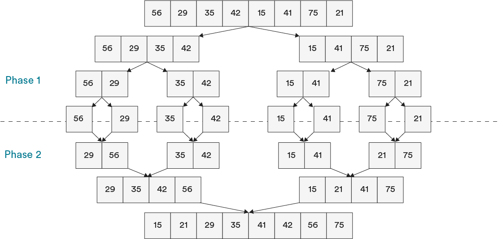
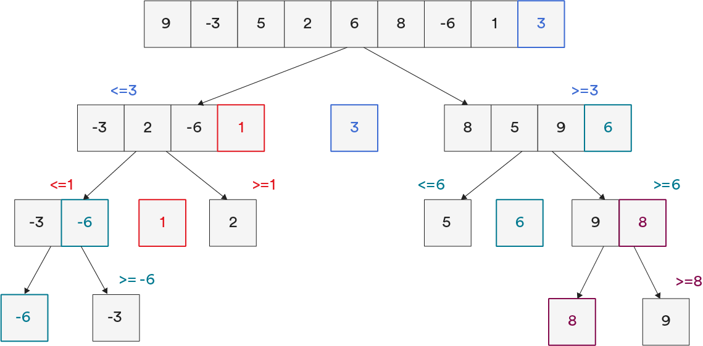

# Divide-and-Conquer Sorting Algorithms

Now we’re cookin’ with gas! The two algorithms that use the “divide-and-conquer” method — merge sort and quick sort — are efficient and widely used in programming. Yes, they’re a bit more difficult to understand and implement, but you’re more likely to encounter them out in the wild.

### TOPICS

- Merge Sort
- Quick Sort

# Learning Objectives

1 of 19

By the end of this lesson, you'll be able to:

- Describe how merge sort and quick sort work.
- Explain the space and time complexities of merge sort and quick sort.
- Identify when to use merge sort or quick sort in a given scenario.

# Go All Julius Caesar on Your Data Sets

2 of 19

In Ancient Rome, Julius Caesar handily conquered France by dividing it up into three parts, then conquering each part one by one. But why should he get to have all the divide-and-conquer fun? As it turns out, you too can use divide and conquer on your data with merge and quick sorts. (For the record, General Assembly would never suggest you go and conquer France.)

Merge and quick sorts are comparison algorithms that solve problems with recursion.

Remember recursion? Recursive functions call themselves and repeat a certain action until a specific condition is reached. It’s like using the algorithm to solve itself. That might feel like cheating, but it’s not — as long as we make sure the algorithm has a way out of the recursion. And we wouldn’t want infinite recursion, would we? (And no, we will never stop making recursion jokes.)

The gist of divide-and-conquer algorithms is pretty simple. If your data set is too big to sort initially, chop it into multiple, smaller pieces until they’re small enough to sort on their own. That’s where the recursion comes in — repeated dividing and sorting until the data set is sorted.

Take this pile of Legos, for instance. You want to sort them by color, but you don’t feel like doing it all in one batch. Let’s use a divide-and-conquer approach here. To start off, you’d split them in half, then in half again, and so on until you have individual Legos. This is the “divide” part. Then, you can sort the individual pieces and put it all back together.

I’ve conquered the sort!

In this lesson, we’ll cover two very important algorithms that use a divide-and-conquer approach: merge sort and quick sort.

# Meet Merge Sort

3 of 19

First, let’s talk about **merge sort**. Merge sort uses an extremely efficient application of “divide and conquer” to sort lists of elements. It takes an array and splits it in half over and over again until it’s small and sorted (there’s the divide part). Then, it merges small sorted pieces together on their way back up (that’s how it conquers). Sound familiar? It’s recursion!

Merge sort is built on two premises:

- The easiest list to sort? A single-item list.
- Creating one large sorted array by merging two smaller sorted arrays? Not hard to do.

# The Components of a Merge Sort

4 of 19

Merge sort is actually two algorithms — the **merge sort** algorithm and the **merge** algorithm — that work together to achieve the same goal. The two algorithms each work in a different phase of the process.

- **Phase 1:** Split the array in half until you can’t anymore (aka, divide). This is accomplished with the merge sort algorithm.
- **Phase 2:** Merge those pieces back together (aka, conquer). This is done with the merge algorithm (sometimes called the “merge helper” function).

# Knowledge Check 1

5 of 19

Which part of merge sort uses recursion?

The merge sort algorithm divides the data set in half until it reaches a base case, when it can't divide it anymore. Hello, recursion! Let's see how that works next.

# Divide: The Merge Sort Algorithm

6 of 19

Like any recursive function, the merge sort algorithm is defined by a base case and a recursive case:

| Case               | **Condition**                         | **Action**                                                                                                                                                                                   |
| ------------------ | ------------------------------------- | -------------------------------------------------------------------------------------------------------------------------------------------------------------------------------------------- |
| **Base case**      | The array is one element or shorter.  | Ta-da! Sorted! Return the array.                                                                                                                                                             |
| **Recursive case** | The array is longer than one element. | Divide the array into two pieces. Call itself again on both the left and right sides you just created. Keep doing this until you have single-element arrays. The base case has been reached! |

Notice that the merge sort algorithm divides arrays until they’re down to single-item arrays but does not check to see if those arrays are sorted. It relies on the fact that zero- or single-element arrays are fundamentally sorted and only returns those.

# Conquer: The Merge Algorithm

7 of 19

Reminder: The merge algorithm is different from the merge sort algorithm.

The merge algorithm, or merge helper function, takes two sorted arrays, compares them, and sorts them into a results list. It keeps doing this until you end up with a large, sorted array. Unlike the merge sort algorithm, the merge algorithm is not recursive.

Here’s the basic process of the merge algorithm. It starts with the sorted single-element arrays already created by its bestie, the merge sort algorithm:

1. Start at the beginning of two arrays of items.
2. Compare the first item from each array to each other.
3. Whichever value is less, copy it to a results list.
4. Move on to the next item in the array that just gave its first element to the results list.
5. Repeat Steps 1–4 until you have all of the elements from both arrays in the results list.

# Merge Sort’s Time Complexity

8 of 19

The two components of merge sort have two different time complexities:

- The non-recursive merge algorithm is an `O(N)` operation — not super efficient. Think about it: Every time you make a comparison, you move one value into the results list. You have to do this N times for each value that you’re merging.
- The recursive merge sort algorithm takes `O(log(N))` time. This is speedy! The number of elements can increase a lot without the complexity increasing very much at all.

To get the overall complexity of merge sort, we multiply `O(log(N))` and `O(N)` to get `O(N log(N))`.

# Knowledge Check 2

9 of 19

What is merge sort’s space complexity?

`O(N)` - The merge algorithm creates a separate "results array" as the data is being merges. That means it's an out-of-place sort and uses `O(N)` space complexity.

# Meet Quick Sort

10 of 19

The second type of divide-and-conquer sort is the **quick sort**. It differs from merge sort in how it approaches the divide phase.

Merge sorts divide an array into two pieces, while quick sorts divide an array into three parts. (Just like France after Julius Caesar got done with it!)

The parts are:

- The **pivot** (a single element).
- The **left partition**, an array containing numbers lower than the pivot.
- The **right partition**, an array containing numbers higher than the pivot.

After this, the pivot is considered sorted, as it’s a single element. Now, we need to recursively call quick sort on the partitioned array on either side of the pivot in order to sort those elements.

# The Quick Sort Process

11 of 19

Let’s visualize how we’d quick sort this array. It’s conventional to use either the first or last value in an array as the pivot, so here we’ll use `3`.

We continue partioning and choosing new pivots as we work through the array until we get to all single-item elements.

# Breaking Down Quick Sort

12 of 19

(video)

Let’s break down a quick sort. It’s a bit of a beast, so bear with us!

Say we start with this unsorted array. We’ll choose the last element as the pivot — in this case, the number “4.” It’s conventional to choose the first or last element in an array as the pivot. Then, we’d partition the array like so. In this case, the pivot, number “4,” is considered sorted. Then, we call quick sort on the remaining two partitions.

Let’s start with the left partition. Now, we choose the number “3” as the pivot for this partition. It’s considered sorted. Because the left and right partitions are single-element arrays, they’re sorted as well.

Now we move onto the original right partition. We’ll choose “6” as the pivot here and partition it. Now we need to partition again. This is the recursive step. The right partition pivot, number “6,” is considered sorted. Since “left2” is a single-element array, it's considered sorted as well.

Now for “right2.” We’ll choose “8” as the pivot here and partition. It’s sorted! So, our final right partition looks like this.

Combining the left partitions and right partitions give us this — a sorted array!

# Visualizing Quick Sort

13 of 19

We know that the concept of quick sort and partitioning is complicated. Luckily, the internet understands that, too. Here are a couple of fun resources you can explore if you want to dive in further:

- [This tool](http://me.dt.in.th/page/Quicksort/) allows you to move through the algorithm on a sample data set step-by-step. Play around with this until you feel like you’ve absorbed what’s happening.
- [This video](https://www.youtube.com/watch?v=ywWBy6J5gz8&list=PLuE79vNc5Wi6q34LsQcaJ7ISQ8uOyMaL_&index=5) helps you visualize quick sort with folk dancing. Do-si-do your way into quick sort confidence!

# Knowledge Check

14 of 19

What is quick sort’s time complexity?

`O(N^2)`, or quadratic complexity, is pretty inefficient. It's bubble sort status! The partitioning in quick sore is what slows it down.

# Quick Sort: Not So Quick After All?

15 of 19

Quick sort’s worst-case efficiency of `O(N^2)` begs the question: Why would we ever use quick sort over merge sort?

Merge sort and quick sort actually have the same average-case time complexity, `Θ(N log(N))`, which is efficient! You can expect their performance to be efficient most of the time.

And in practice, quick sort tends to even be a little bit faster than merge sort. Why? Because quick sort has a much lower space complexity, at `O(log(N))`, than merge sort’s space complexity of `O(N)`. Using up all of that extra memory can slow merge sort down at times.

But sometimes, merge sort will win out. Quick sort gets tripped up on data sets with very similar values. If you’re trying to sort a list like the following, merge sort is bound to win!

`[3, 5, 5, 3, 3, 5, 3, 3, 3, 5, 5, 3, 5, 3, 3]`

# Quick Sort vs. Merge Sort

16 of 19

Here are some of the ways in which quick and merge sorts are used:

| **Quick Sort**                                                       | **Merge Sort**                                                                       |
| -------------------------------------------------------------------- | ------------------------------------------------------------------------------------ |
| Better in a virtual memory environment.                              | Useful in database scenarios.                                                        |
| Built-in sort function in C programming languages, Java, and Python. | Useful when additional data may arrive during or after sorting.                      |
| Works better for caching environments.                               | Used by Safari and Firefox in their implementation of JavaScript’s `.sort` function. |

# Let’s Talk About Interviews

17 of 19

In a job interview, you might be asked to sketch out how merge sort and quick sort work, or to compare the two and describe situations in which you’d use one or the other.

- Use this tool to [compare merge and quick sort](https://www.cs.usfca.edu/~galles/visualization/ComparisonSort.html) (and other sorting algorithms).
- Revisit our folk-dancing friends to [understand merge sort](https://www.youtube.com/watch?v=XaqR3G_NVoo).
- Earlier in this lesson, we linked to tools for understanding quick sort. Play with those!

Check out these videos for a recap on how the two algorithms work and discover what they look like sketched out: [merge sort](https://www.youtube.com/watch?v=TzeBrDU-JaY) and [quick sort](https://www.youtube.com/watch?v=COk73cpQbFQ&list=PL2_aWCzGMAwKedT2KfDMB9YA5DgASZb3U&index=9).

# Time to Practice

18 of 19

Now, it’s over to you! Want to practice writing merge and quick sorts? Try them out in [this CodePen](https://codepen.io/GAmarketing/pen/MxWpQW).

This exercise doesn’t have much pseudocode, but you can look back in this lesson, which features some for merge sort. (We’ve also included code for the merge helper function, so you don’t have to worry about writing that one!)

Remember to...

- Fork the Pen before editing it.
- Not touch the test scripts at the bottom.

These algorithms — especially quick sort — are difficult. See how far you can get on your own!

# Divide-and-Conquer Sorting Algorithms

Merge sort and quick sort are efficient algorithms that form the backbone of the default sorting function in many programming languages.

**Merge sort** has two components: the merge sort algorithm, which divides an array into single elements, and the merge function (or the merge helper function), which merges the sorted arrays back together.

- Runtime: `O(log(N))`
- Space complexity: `O(N)`
- Stable

**Quick sort** uses a similar “divide-and-conquer” approach, instead with a partitioning method that divides an array around a pivot element and then combines the sorted arrays.

- Runtime: `O(N^2)`
- Space complexity: `O(log(N))`
- Unstable

### TOPICS

- Merge Sort
- Quick Sort
