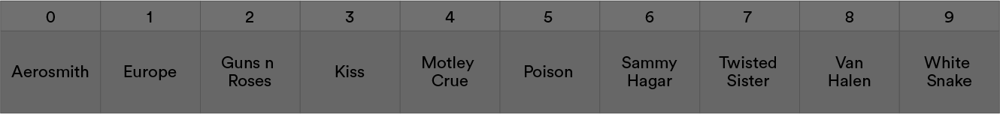

# Search Algorithms

No, learning search algorithms doesn’t mean you’ll be able to hack Google’s — yet. In this lesson, we’ll cover brute force search, which is just as inelegant as it sounds (Spoiler alert: You’ve already been doing it all this time), along with the shiny new binary search algorithm.

### TOPICS

- Brute Force Search
- Binary Search
- Insertion in Binary Search

# Learning Objectives

1 of 17

By the end of this lesson, you'll be able to:

- Understand the Big O complexities of brute force and binary search approaches.
- Describe how binary search works.
- Write a binary search algorithm to find a value in an array.

# Search: It’s Been There All This Time

2 of 17

Programmers, when you were first taught arrays, your instructor most likely asked you to write code to find an element in an array. Or, maybe they asked you to write code to locate the index of an element in an array.

Let’s pretend you had to find the band “Def Leppard” in an array of hair metal bands.

Your final product may have looked something like this:

```js
// Determine if Def Leppard is in the array and find its index if so:
const hairMetal = ["Kiss", "Guns n Roses", "Van Halen", "Sammy Hagar", "Aerosmith", "Twisted Sister", "Motley Crue", "White Snake", "Poison", "Europe"]
let searchTerm = "Def Leppard"
let found = false;
let index = -1;
for(let i = 0; i < hairMetal.length; i++) {
  if hairMetal[i] === "Def Leppard" {
    found = true;
    index = i;
  }
}
if(found) {
  console.log(`${searchTerm} is located at index ${index} in the array`);
} else {
  console.log(`${searchTerm} not found`);
}
```

# And Then You Made it Better

3 of 17

As you were doing it, you probably realized that, once the element or index had been found, the computer didn’t need to keep searching for it. So, you added a `break`, or a statement that told the algorithm to stop looking for the element once it was located:

```js
for(let i = 0; i < arr.length; i++) {
  if arr[i] === "Def Leppard" {
    found = true;
    index = i;
    break;
  }
}
```

This means you were thinking about algorithmic complexity — making sure the algorithm didn’t keep running forever — even if you weren’t aware of it at the time. (Yes, Big O has always been haunting you.)

# And Then You Learned Array Methods

4 of 17

Later on, you probably discovered array methods like `.indexOf()`, `.findIndex()`, and `.find()` and learned to appreciate the elegance they added to your code:

```js
const hairMetal = [
  'Kiss',
  'Guns n Roses',
  'Van Halen',
  'Sammy Hagar',
  'Aerosmith',
  'Twisted Sister',
  'Motley Crue',
  'White Snake',
  'Poison',
  'Europe',
];
// Locate Def Leppard in the array if it’s there:
const index = hairMetal.indexOf('Def Leppard'); // index === -1 because it wasn't found.
```

Your code was elegant indeed but not any more efficient. These methods are basically just fancy `for` loops, so the computer had to scan all the way through the array to know “Def Leppard” wasn’t there.

# Knowledge Check 1

5 of 17

What is the worst case time complexity of a single for loop?
`O(N)` - A `for` loop will iterate once through every element in the input. When we serach through each item in an array, we get `O(N)` complexity.

# Brute Force Search

6 of 17

(video)

- Transcript

In computer science, we use the expression “brute force” to refer to any algorithm that tries every possibility available.

For example: Try every item on the menu to see if any of them involve fried chicken; check every single brand of cereal in the store to see which has the most protein; try on every pair of shoes in the store to make sure you’re finding the best fit and style; you know your long-lost dear friend lives on Ashland Avenue in Chicago, which is 25 miles long, but you’re not sure exactly where, so you knock on every single door on Ashland Avenue until you find her.

In real life, these kinds of problem-solving approaches are typically absurd. You can often use your super-smart, human-level brain to do better. Trying every menu item to see if they have fried chicken might be delicious, but it’s an inefficient — and expensive — approach. Instead, you’d just look under “poultry dishes” on the menu. Or, in the case of choosing shoes, you can use your eyes to judge the style and check the size.

But the computer can’t really do that. And sometimes, neither can you. If you wanted to find the cereal with the most protein, you might actually have to read every box to figure it out!

# But What If I Told You...

7 of 17

That the array was already sorted?

Consider this: Would you rather try to find a word in a dictionary in which all of the words are alphabetized? Or one in which all of the words are in a totally random order?

If we sort our hair metal bands array alphabetically, we can leverage the computer’s special abilities:

```js
hairMetal.sort();
console.log(hairMetal);
// => ["Aerosmith", "Europe", "Guns n Roses", "Kiss", "Motley Crue", "Poison", "Sammy Hagar", "Twisted Sister", "Van Halen", "White Snake"]
// It's now sorted alphabetically!
```

# It Just Keeps Getting Better: Binary Search

8 of 17

With our newly sorted array, we can implement binary search to find a value. It’s similar to how we’d find a word in a dictionary — another nicely sorted array of values.

From a programming standpoint, it looks like this:

```
Given a sorted array and a search value,

    Find the middle element in the array. (If the array has an even number of elements, then take the one just left of center.)

    Did we get lucky — is this it?

        Then, great!  We’re done!

    If not,

        If the word we’re searching for comes before this middle element,

            Search the subsection of the array from 0 to the element right before the middle element.

        Or, if it comes after this middle element,

            Search the subsection of the array from just to the element through to the end.
```

# Binary Search in Action

9 of 17

(video)

- Transcript

Let’s see how we’d look for “Def Leppard” in our newly sorted array.

The first thing to do is to find the middle of the array. The middle element is the one to the left of center. So the index is “4,” which contains “Motley Crue,” which is not “Def Leppard” and comes after “Def Leppard” alphabetically.

Now, let’s repeat the process on the left subsection of the array, where we think “Def Leppard” should be. This is great — we’ve cut the size of our task in half! This time, we’ll find the middle of the section, which is “Europe,” which should definitely come after “Def Leppard.”

So next, we need to look at the little subarray to the left of “Europe,” which is just a single element — and it ain’t “Def Leppard.”

# Finishing the Search

10 if 17

Now it’s time to think about terminating our search. First, let’s update our algorithm a bit:

- If we’re down to a one-element array subsection and that element isn’t the one we want, we know the element isn’t there.
- If, after halving, we get down to an array of size `0`, we know the element isn’t there.

“Def Leppard” is nowhere to be found. Our algorithm would return `-1`.


# Knowledge Check 2

11 of 17

What is the worst case time complexity of binary search?

`O(log(N))` - A Binary serch cuts the problem in half and repeats as needed. Without getting too much into logarithms, the number of halvings is `log2N`. In the world of Big O, this leave us with `O(log(N))`.

# Bringing Recursion to the Conversation

12 of 17

If you look at the process and diagrams from this example, you can see that binary search lends itself nicely to recursion. We’re performing the same logic on ever-shrinking parts of the array! So, let’s also add a little language to our algorithm that explicitly indicates our intent to use recursion on subsections of the array between specific start and end points.

(And yes, you could use a `while` loop here, too, but you know we love the slickness and elegance of recursion at times like these!)

```
Given an array, a value, and specified start and end points,

    Find the middle element in the specified subsection. (If this subsection of the array has an even number of elements, take the one just left of center.)

    Is there just one element in this subarray? Is that what we want?

        Then great — we’re done! We have our index.

    If our subsection got shrank all the way down to 0 size,

        Then, welp, it’s not there.

    If not,

        If the word we’re searching for comes before this middle element,

            Search the subsection of the array from 0 to the element right before the middle element.

        Or, if it comes after this middle element,

            Search the subsection of the array from just to the element through to the end.
```

# Knowledge Check 3

13 of 17

Which part of the recursive binary search algorithm is the base case?

```
Given an array, a value, and specified start and end points,

    Find the middle element in the specified subsection. (If this subsection of the array has an even number of elements, take the one just left of center.)

    Is there just one element in this subarray? Is that what we want?

        Then great — we’re done! We have our index.

    If our subsection got shrank all the way down to 0 size,

        Then, welp, it’s not there.

    If not,

        If the word we’re searching for comes before this middle element,

            Search the subsection of the array from 0 to the element right before the middle element.

        Or, if it comes after this middle element,

            Search the subsection of the array from just to the element through to the end.
```

**ANSWER:**

        Is there just one element in this subarray? Is that what we want?
            Then great — we’re done! We have our index.

This is the base case, because it tells the algorithm when to stop looking.

# A Nice Little Bonus

14 of 17

(video)

- Transcript

Warning: This part might bend your brain a bit! But bear with us.

The way we’ve been writing the search function, when it doesn’t find the element, it returns “-1.” But what if I told you that the function could return a negative number whose absolute value is where the element would be if it were there? Maybe you’d want this if you wanted to insert something into an array if the search didn’t turn it up. We could return the negative value of the index where the value should be. So, in our hair metal bands example, we would return “-1.” Sounds simple enough, right?

But what if we wanted to add a value that should go at the “0” index? Maybe we wanted to add the band “ABBA” to this array. The way we’re going, we’d return negative “0”… which is just “0.” There’d be no way to tell if it was trying to tell us, “0 is where your element is located” or, “0 is where your search term should be inserted.”

Here’s a solution: If the element isn’t found, find the index where it should go — for “Def Leppard,” it would be index “1.” Make that number negative — now we have “-1.” Make it one less — now we have “-2.”

Another example: Let’s say that we wanted to find the value “15” in this array. We know that “15” should go at index “2” in the array. So, we’ll make that number negative — it’s “-2.” Then, we’ll make it one less — now it’s “-3.” In this situation, our new binary search function should return “-3.”

In this format, a negative number will always tell you that the value isn’t present but can be inserted at that spot. You’d want to communicate to the person using your function that the absolute value of that negative integer is one index higher than the index where they should insert their value.

# Let’s Talk About Interviews

15 of 17

Check out these two articles explaining common ways in which binary search appears in job interviews:

- [Coding Freak](https://medium.com/techie-delight/binary-search-practice-problems-4c856cd9f26c) (includes some practice problems!).
- [Some more ways](http://blog.gainlo.co/index.php/2017/01/12/rotated-array-binary-search/) that binary search appears in interviews.

Thought our folk-dancing friends only did sorting? [Think again](https://www.youtube.com/watch?v=iP897Z5Nerk)! This video can help you visualize the binary search process.

# Time to Practice

16 of 17

Over to you! [This CodePen](https://codepen.io/GAmarketing/pen/aMbWQj?editors=0010#0) contains pseudocode for two binary search implementations: iterative and recursive. (It also has test scripts so you can check your work.)

Remember:

- Fork the Pen before you get started.
- Don’t touch the test scripts at the bottom.

These are some complicated functions! Try out the non-recursive implementation first. Then, if you figure that out, move on to the recursive implementation.

# Search Algorithms Review

17 of 17

In this lesson, you learned how the binary search algorithm efficiently (with O(log(N)) complexity!) searches a data set for a given value. This process:

1. Starts at the middle of an array and determines if the search value is higher or lower than the middle element.
2. Focuses on the half of the array where the value could be (effectively eliminating half of the array).
3. Continues until it finds the search value or realizes it’s not there!

If a value isn’t found, you can tell the algorithm to return a negative number that represents where the value should be inserted.

### TOPICS

- Brute Force Search
- Binary Search
- Insertion in Binary Search
