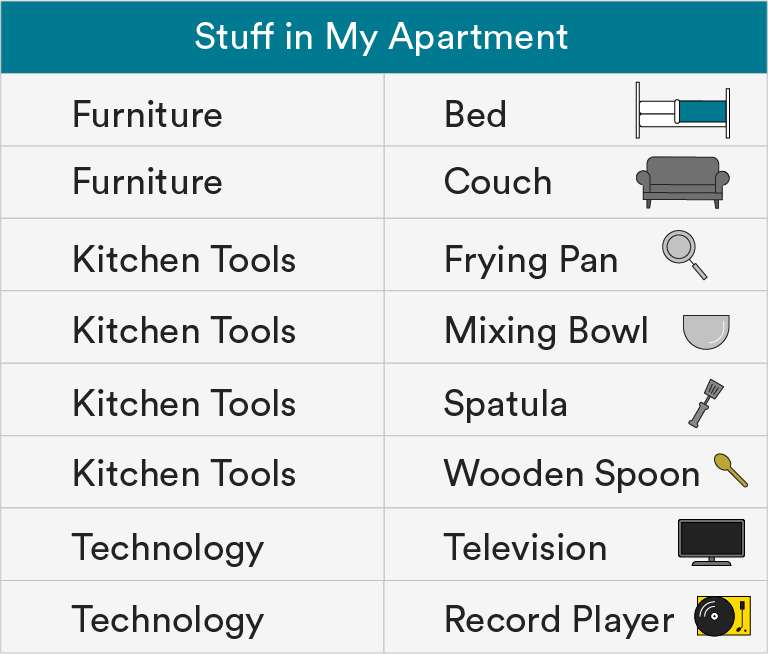
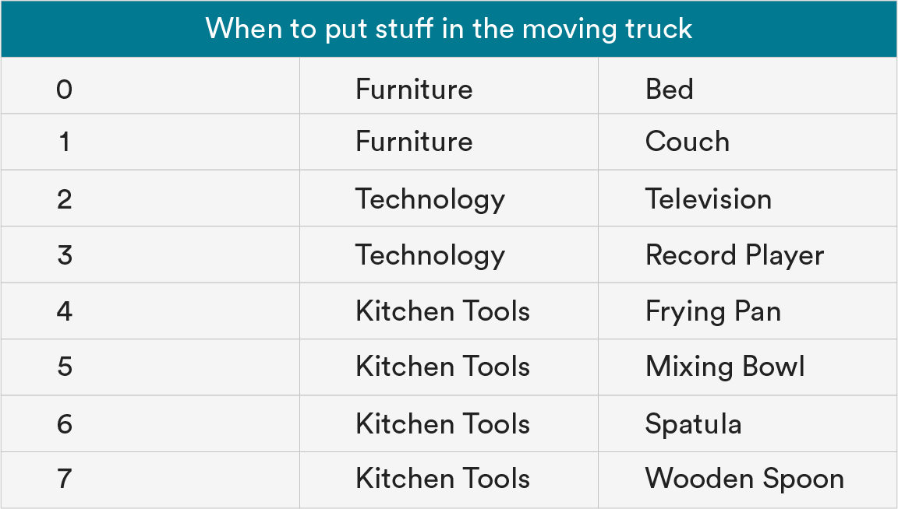
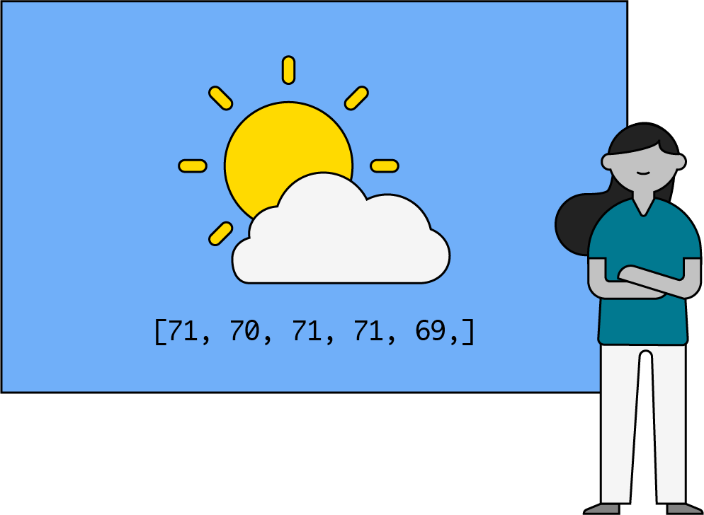
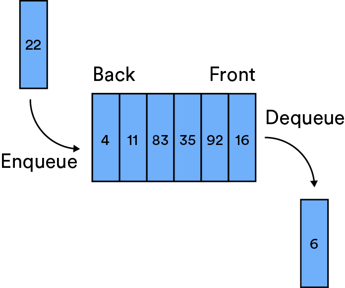
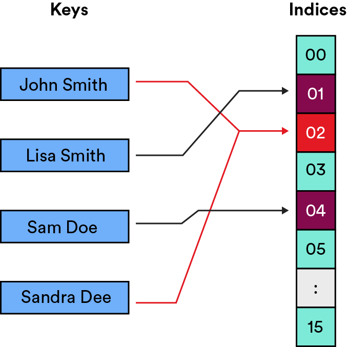
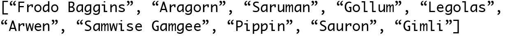
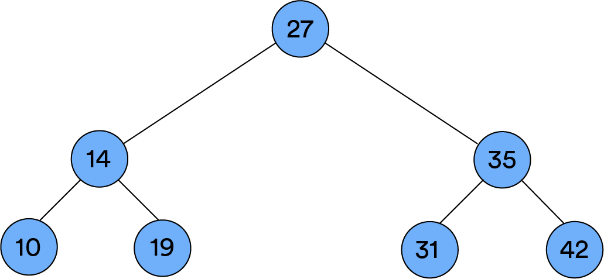
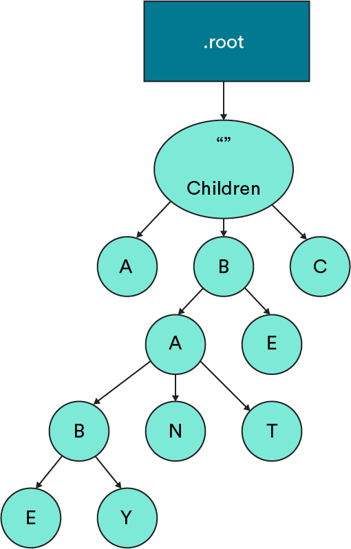
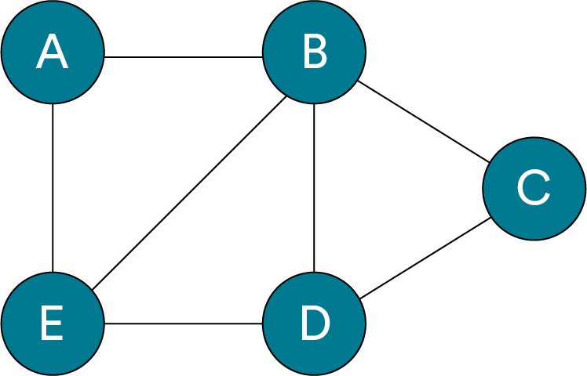

# Introduction to Data Structures

Data structures — how hard could they be? You put your data in a certain structure and then you’re good to go, right? As with anything in computer science, there’s a lot more variety and nuance than that. In this lesson, we’ll introduce data structures and review arrays as a precursor to learning more complex structures.

### TOPICS

- Data Structure Operations
- Working With Arrays

# Learning Objectives

1 of 11

By the end of this lesson, you'll be able to:

- Explain how data structures are used in computer science.
- Define the five basic operations to perform on a data structure.
- Build an array and perform basic functions in it.

# What Is a Data Structure?

2 of 11

Take this data set, for example.

A data “structure” is like a container that stores data in a specific, organized layout. If you look at our table, you can quickly see how the bed (data point) is a type of furniture (data structure) and the mixing bowl (data point) is a type of kitchen tool (data structure).

A data structure is also organized in some way — just like the table of “stuff in your apartment” is organized alphabetically.

# Why Data Structures?

3 of 11

- Transcript

Data structures specifically define how data points should be organized so they can be accessed, used, and analyzed more easily. It sets the basis for any algorithms or tasks we’d add to it later.

Let’s say you’re moving out of your apartment. You might structure the “stuff in your apartment” in the order you want it put into the moving truck. (Personally, we think you should put the big stuff in first and then add the smaller things on top, but if you have a better strategy, we’re all ears.)

# Choosing a Data Structure

4 of 11

Before we can access, add to, or search a data structure, we have to choose the type we want to use. Data can be structured in lots of different ways (which we’ll get into later). Each allows us to do things with the data more or less efficiently.

No one data structure is equally efficient for all actions, and some data structures don’t support certain actions at all. That’s why it’s critical to structure your data well from the get-go.

For example, this structure is helpful if we’re moving but not quite so useful if we’re trying to figure out what stuff is in the apartment (i.e., searching or accessing this data set).

# The Importance of Understanding Data Structures

5 of 11

(video)

- Transcript

Anything that you do, from measuring a click on a web app to creating a data structure on the back end, it all has to actually have this synergy. If you don't have a thorough understanding of a data structure - and by thorough I mean knowing how to use it in some good capacity - then you will not have a clear understanding of how a product on a function level does work and if that something does go wrong.

# Starting With Basics: The Array

6 of 11

The most simple, commonly used data structure across all programming languages is one you already know and love: An **array**.

An array is a collection of items that can be accessed individually via an index that lists the position of items in that array.

If we were to format our “kitchen tools” stuff as an array, it would look like this:

# Characteristics of Arrays

7 of 11

Arrays share a few key characteristics. They...

- Are **indexed**. In most programming languages, the index starts at `0`.
- Depending on the programming language, can be either **fixed size **(Java, C) or **changeable size** (JavaScript, Ruby).
- Are typically restricted to **one data type** — integers, strings, Booleans, etc.

Their specifications are also consistent across most programming languages.

| **Operation**              | **Description**                                    |
| -------------------------- | -------------------------------------------------- |
| `myArray = [1,2]`          | Create a new array with the values of `1` and `2`. |
| `myArray = newArray(size)` | Create a new array of length (`size`).             |
| `myArray.length`           | Return the size of the array.                      |
| `myArray[i]`               | Return the value at the index in the array.        |
| `myArray[i] = value`       | Set the value at the index in the array.           |

# Putting Arrays to Work

8 of 11

Arrays are also an excellent choice for storing data when you know the exact size of the data set.

Imagine you’re a meteorologist preparing to present the daily forecast. You have the average temperature for each day of the past week and, because you’re also a computer scientist (a real jack of all trades), you format that data in an array:

`let weatherData = [54, 57, 51, 51, 55, 58, 56]`

You want to calculate the average daily temperature for the week using your computer science skills. You also know you probably want to use a loop to get this answer. Simple enough!

# Limitations of Arrays

9 of 11

Unfortunately, an array can’t immediately answer all of the questions we might ask about our weather data:

`let weatherData = [54, 57, 51, 51, 55, 58, 56]`

- Did any two days have the same average temperature?
- Which temperature appears the most?
  To answer these questions, we’d have to write additional code to process data inside the array.

Or, we could just use a different data structure! An alternate structure may allow us to store the data points — in this example, the temperatures — in a way that answers our questions without having to write any extra code.

Let’s take a quick look at the data structures we’ll cover throughout the rest of this unit.

# The Great Data Structures

10 of 11

### Linked Lists

Lists that store data inside of nodes that point to each other.

### Stacks

Lists of ordered values in which the first item in is the last item out.

### Queues

Lists of ordered values in which the first item in is the first item out.

### Hash Tables

List-like structures that use a hash function to generate keys for values.

### Sets

Similar to an array, but can only contain unique values.

### Binary Trees

Node-based structures that store values using left and right pointers.

### Trees

Tree structures in which nodes can store lists of child nodes; almost always used for strings.

### AVL Trees

A binary tree that's balanced. Notice how each side of this tree is a similar height? That means it's balanced.

### Graphs

Collections of nodes and edges in which nodes store data and edges represent connections between data.

### Introduction to Data Structures

11 of 11

As we learn about each data structure, we’ll be bringing back what we learned about sorting, search algorithms, and Big O notation to differentiate between them.

We’ll also learn more about how each data structure may come up in job interviews. For now, check out a high-level overview of some common data structure topics and questions:

- [Common data structure interview topics](https://www.geeksforgeeks.org/commonly-asked-data-structure-interview-questions-set-1/).
- [More data structures sample questions](https://career.guru99.com/top-50-data-structure-interview-questions/).

### TOPICS

- Data Structure Operations
- Working With Arrays
