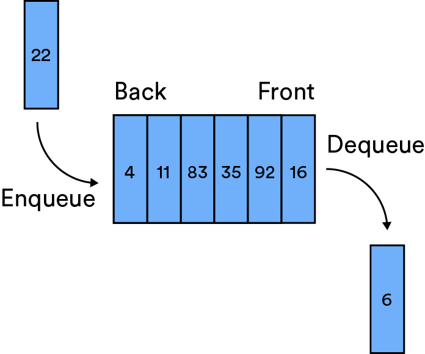

# Stacks and Queues

Want to you know why you’d LIFO elements that can’t be FIFOed? Or maybe you just want to know what the heck is up with those acronyms? In this lesson, we’ll learn about stacks and queues and their distinctive LIFO and FIFO behaviors.

### TOPICS

- Distinguishing Between Stacks and Queues
- How Stacks Work
- How Queues Work

# Learning Objectives

1 of 18

By the end of this lesson, you'll be able to:

- Distinguish between the behavior of a stack and a queue.
- Determine situations in which you’d use a stack or queue versus another data structure.
- Build a stack and a queue using a linked list or an array.

# Setting the Stage

2 of 18

- Transcript

Stacks and queues in computer science are a lot like stacks and queues in real life. It helps if you think of stacks of pancakes and queues, or lines, of people.

Let’s take a look. It’s Saturday morning, and out of the kindness of your heart you decide to make pancakes for your family. You’re gathering all the ingredients when you check the fridge and discover you’re out of eggs! You rush to the grocery store, grab the eggs, and of course the line to check out — the queue — is five-people deep. You move to the back and wait your turn.

Waiting in line for the cash register mirrors how a queue works in computer science. They’re defined by first-in, first-out behavior. That is, the first thing that’s added to a queue will be the first thing removed; the first person in line will be the first person who gets to check out.

Now for stacks. You’ve made it home and the pancakes are coming together beautifully. As you cook, you flip the pancakes off the griddle and onto a plate. You finish up the last batch and bring the pancakes to the table to serve your family. Which pancakes are going to be taken first? The hot, fresh pancakes on the top of the stack? Or the pancake on the bottom that’s now cold and getting smushed? We know which one we’d take — the hot one on the top.

Watching your family take the fresh pancakes off the top of the plate is how a stack works. A stack is defined by last-in, first-out behavior — the opposite of how a queue works. The last thing added to the stack — the freshest pancake — is the first thing to be removed.

# Visualizing Stacks and Queues

3 of 18

Stacks and queues are defined by their behavior — in other words, how items are added to and removed from them:

| **Stacks Queues**                                                                                                     | **Queues**                                                                                                                 |
| --------------------------------------------------------------------------------------------------------------------- | -------------------------------------------------------------------------------------------------------------------------- |
| Operate on “last-in, first-out” (aka, LIFO) behavior. The last, most recently added item, is the first to be removed. | Operate on “first-in, first-out” (aka, FIFO) behavior. Items are removed in the order they were added, from first to last. |

| |  |

# Stacks in Programming

4 of 18

Obviously, stacking (and eating) pancakes is more delicious and a lot less complicated than computer science. But, stacks and queues are behind a lot of the computer functionalities you know and love.

Have you ever used the “back” button on your browser? Used the “undo” or Cmd-Z function? You interacted with a stack! All of these examples refer to the most recent action — hence, “last in, first out” (LIFO).

The function call stack is another common example of stacks in programming. When you call a function to execute, it’s pushed to the top of the stack and runs until we add another function to the stack, which then runs until it returns (or another function is pushed to the top). You can keep adding functions until you’ve run out of space in the stack, in which case you’ve reached stack overflow.

(If only you could have pancake stack overflow!)

# Queues in Programming

5 of 18

Queues also have applications you’re probably pretty familiar with.

Have you ever sent a document to the printer? Documents in the queue will print in the order they were sent, from first to last. That’s where we get “first in, first out,” or FIFO.

Computer processing unit (CPU) scheduling is also based on a queue. Tasks are executed in the order in which they were called, while the execution of tasks further down in the queue is put on hold until resources are available.

# Different, But the Same

6 of 18

Stacks and queues might seem totally different, but they actually have a lot in common.

One important similarity is that we can perform the **same relatively limited set of actions** on them.

The trade-off for limited functionality? Great runtimes, which are the same for stacks and queues! Check it out:

| Function        | Name in a Stack | Name in a Queue | Complexity |
| --------------- | --------------- | --------------- | ---------- |
| **Access**      | `Peek`          | `Peek`          | `O(1)`     |
| **Insert**      | `Push`          | `Enqueue`       | `O(1)`     |
| **Delete**      | `Pop`           | `Dequeue`       | `O(1)`     |
| **Check empty** | `isEmpty`       | `isEmpty`       | `O(1)`     |

# Knowledge Check

7 of 18

Imagine that you started with an empty stack and perform the following operations:

1. `PUSH 0`
2. `POP`
3. `PUSH 2`
4. `PUSH 4`
5. `PUSH 6`
6. `POP`
7. `PUSH 8`

What would the stack look like at the end? (Hint: It might help to sketch this out on a piece of paper!)

You should get `[2, 4, 8]`. Here’s how that would go:

`start [] --> PUSH 0 --> [0] --> POP --> [] --> PUSH 2 --> [2] --> PUSH 4 --> [2, 4] --> PUSH 6 --> [2, 4, 6] --> POP --> [2, 4] --> PUSH 8 --> [2, 4, 8]`

# Knowledge Check

8 of 18

Imagine that you start with an empty queue and perform the following operations:

1. `ENQUEUE 15`
2. `DEQUEUE`
3. `ENQUEUE "Popcorn"`
4. `ENQUEUE 515`
5. `ENQUEUE "GA"`
6. `DEQUEUE`
7. `ENQUEUE "Smile!"`

What would your queue end up looking like?

### Our Answer

You should get `[515, "GA", "Smile!"]`. Here’s how:

`start [] --> ENQUEUE 15 --> [15] --> DEQUEUE --> [] --> ENQUEUE "Popcorn" --> ["Popcorn"] --> ENQUEUE 515 --> ["Popcorn", 515] --> ENQUEUE "GA" --> ["Popcorn", 515, "GA"] --> DEQUEUE --> [515, "GA"] --> ENQUEUE "Smile!" --> [515, "GA", "Smile!"]`

# Different, But the Same (Part 2)

9 of 18

The other thing that stacks and queues have in common is that they can both be implemented as an **array** or as a **linked list**.

Other than using different underlying data structures, there’s no major difference between array and linked list implementation. Which you use depends on how your data is already structured and how you expect to be inserting or removing elements. In the next section, we’ll look at each implementation for each data structure.

# Knowledge Check

10 of 18

Quick refresher: The major difference between a linked list and an array is how they store data in a computer’s memory.

Which of the following statements is true about how linked lists and arrays store data?

- [ ] Linked lists store data in one continuous block of memory.
- [x] Arrays store data in one continuous block of memory
- [x] Linked lists can store data anywhere in a computer's memory using pointers.
- [ ] Arrays can store data anywhere in a computer's memory using the index

**Correct:** Remember: Arrays need one continuous block of memory to store data. If you need more memory space for your data, you’ll have to find a new block of memory. Linked lists, on the other hand, are more flexible, as they can point to data stored in many different locations using pointers.

Next, let’s see how stacks and queues are implemented with each data structure.

# Implementing Stacks

11 of 18

### Linked List Implementation

```js
class Node {
  constructor(data, next = null) {
    this.data = data;
    this.next = next;
  }
}

class Stack {
  constructor() {
    this.head = null;
  }

  push(data) {
    this.head = new Node(data, this.head);
  }

  pop() {
    let data = this.head.data;
    this.head = this.head.next;
    return data;
  }

  peek() {
    return this.head.data;
  }

  isEmpty() {
    return this.head == null;
  }
}
```

### Array Implementation

```js
class Stack {
  constructor() {
    this.items = [];
  }

  push(item) {
    this.items.push(item);
  }

  pop() {
    return this.items.pop();
  }

  peek() {
    return this.items[this.items.length - 1];
  }

  isEmpty() {
    return this.items.length === 0;
  }
}
```

# Implementing Queues

12 of 17

### Linked List Implementation

```js
class Node {
  constructor(data, next = null, prev = null) {
    this.data = data;
    this.next = next;
    this.prev = prev;
  }
}

class Queue {
  constructor() {
    this.head = null;
    this.tail = null;
  }

  enqueue(data) {
    let newNode = new Node(data, null, this.head);

    if (!this.head) {
      this.head = newNode;
    } else {
      this.tail.next = newNode;
      newNode.prev = this.tail;
    }

    this.tail = newNode;
  }

  dequeue() {
    let data = this.head.data;
    this.head = this.head.next;
    return data;
  }

  peek() {
    return isEmpty() ? 'empty list!' : this.head.data;
  }

  isEmpty() {
    return this.head == null;
  }
}
```

### Array Implementation

```js
class Queue {
  constructor() {
    this.items = [];
  }

  enqueue(data) {
    this.items.push(data);
  }

  dequeue() {
    return this.items.shift();
  }

  peek() {
    return isEmpty() ? 'empty list!' : this.items[0];
  }

  isEmpty() {
    return this.items.length === 0;
  }
}
```

# Variations on a Queue: The Priority Queue

13 of 18

Queues have a couple of unique implementations we’ll touch on quickly.

The first is a **priority queue**. This has three rules in addition to those of a typical queue:

1. Every item has a priority associated with it.
2. An element with high priority is dequeued before an element with low priority.
3. If two elements have the same priority, they are served according to their order in the queue.

Have you ever been waiting in an airport security line only to be passed by someone with priority boarding? They still wait in line, but their “priority” moves them up more quickly.

CPU scheduling is commonly implemented as a priority queue. While the first tasks are completed first, any subsequent task that’s a “priority” will be moved up.


# Variations on a Queue: The Double-Ended Queue

A double-ended queue (“deque,” for short) is a queue that performs insertions and deletions at both ends. It’s typically implemented with a doubly linked list or a dynamic array. These are often used for task-scheduling algorithms.

Have you ever been dead last in a long line at the grocery store only to see a cashier one lane over open up their register? Typically, that cashier will beckon to you to jump into their lane so you can be checked out right away. That’s basically what happens in a deque.

In computer science, this might be comparable to spreading tasks between several different servers as equally as possible. Each of these server machines maintains a double-ended queue of tasks that they need to crunch through. Mostly, this deque just functions as a regular queue, adding tasks to the end and processing them in the order they were received (FIFO). However, if one of your servers has no tasks in its own queue, it can take from the end of another server’s queue. They help each other out!


# Knowledge Check

15 of 18

You’re working on building a message board and you want to display only the 10 most recent messages a user posted, in the order they were posted. Which data structure should you use?

- [ ] stack
- [x] queue
- [ ] priority queue
- [ ] double-ended queue

The earliest messages - the first ones added - should be removed as new messages are added. That's FIFO; how a regular old queue works.

# Knowledge Check

16 of 18

You and your partner are going out for your anniversary dinner. When you arrive, you ask the host for a table for two and your name goes on the waiting list. While you’re waiting, a group of seven people walks right in and gets seated. What gives?!

Which data structure is the restaurant using to seat customers?

- [ ] stack
- [ ] queue
- [x] priority queue
- [ ] double-ended queue

It's generally FIFO for groups of the same priority. For example, you and your partner will be seated before another group of two that came in later. However, the restaurant wants to prioritize large groups (like groups of seven) as soon as it has enough space available. Otherwise, the group would never get seated!

# Let’s Talk About Interviews

17 of 18

If stacks or queues come up in an interview, you’ll likely be asked to perform operations such as sorting, inserting, and finding values — and it only gets more complicated from there.

- [This article](https://www.geeksforgeeks.org/stack-data-structure/) on stacks outlines some standard problems that could come up in interviews.
- The [same article](https://www.geeksforgeeks.org/queue-data-structure/), but for queues.
- Don’t forget to review [priority queues](https://www.geeksforgeeks.org/priority-queue-set-1-introduction/) and [deques](https://www.geeksforgeeks.org/deque-set-1-introduction-applications/). (You might not be asked to build one of these, mostly to explain how they work and their uses.)

Use these visualization tools to practice building stacks and queues:

- Stacks: [array implementation](https://www.cs.usfca.edu/~galles/visualization/StackArray.html) and [linked list implementation](https://www.cs.usfca.edu/~galles/visualization/StackArray.html).
- Queues: [array implementation](https://www.cs.usfca.edu/~galles/visualization/QueueArray.html) and [linked list implementation](https://www.cs.usfca.edu/~galles/visualization/QueueLL.html).

# Stacks and Queues

18 of 18

Congrats — you’ve made it into another level of the computer science club! This one is all about the secrets of stacks and queues.

Remember:

- Stacks operate with last-in, first-out (LIFO) behavior.
- Queues operate with first-in, first-out (FIFO) behavior.
- Both stacks and queues can be implemented as an array or a linked list.

### TOPICS

- Distinguishing Between Stacks and Queues
- How Stacks Work
- How Queues Work
