# Introduction to Hash Tables

1 of 25

Take a journey with us to the very quaint (and very fictional town) of Memoryville. We’ll learn about how hash tables, an important and complex data structure, solved a crisis of space and usage for the small town — and could do the same in computer science.

### TOPICS

- Hash Tables and the Hash Function
- Collisions
- Chaining

# Learning Objectives

2 of 25

By the end of this lesson, you'll be able to:

- Define hash functions and hash tables.
- Articulate the benefits of hash tables, in particular as they relate to speed of data access.
- Define collisions and how to resolve them.

# A History of Hashing: Memoryville

3 of 25

Many years ago, in the small but high-tech town of Memoryville, a serious problem began to emerge in the real estate market. The traditional methods that locals had been using to find places to live were time-consuming, and people were so dissatisfied that they started moving elsewhere.

So, the city created a co-op called Key-Value Properties and conscripted several local computer scientists to be on its board. These board members were promised ample funding if they could speed up the house-hunting process for current and future Memoryville residents.

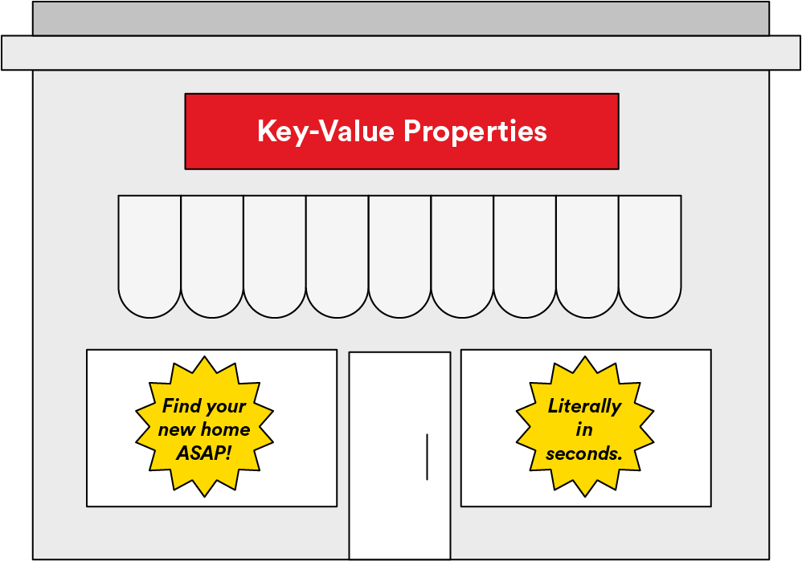

# Their Goal: Find Addresses, Stat

4 of 25

Key-Value Properties was given the best land in the city: right downtown on the east side of Perfect Avenue, across the street from a park. It built 11 state-of-the-art cottages with sustainable micro-farms in their backyards. It was the pride of Memoryville!

Because they were all computer scientists, the Key-Value board members naturally decided that the addresses would start with `0`. And, because there’s a park on the other side of the street, it used both even and odd addresses from `0` to `10`, even though the houses were all in a row. (The board didn’t ask the post office about any of this.)

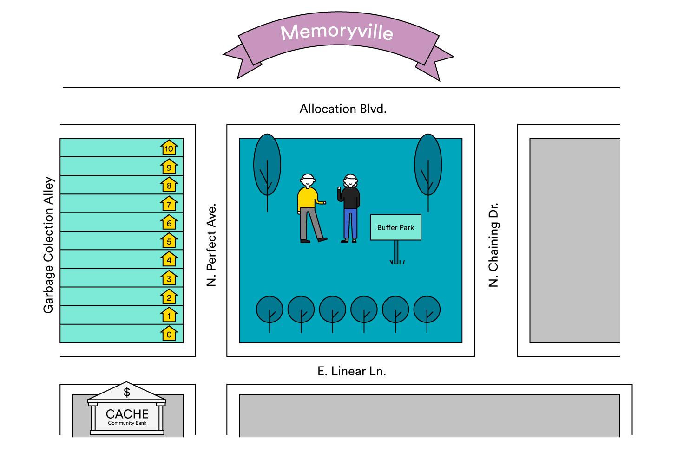

# Everybody Gets a House!

5 of 25

Residences were available on a first-come, first-served basis and were open to all. However, because of the strict requirement that house searching happen quickly, residents were not allowed to choose a specific cottage — they had to agree to leave that to the co-op board.

As the Key-Value Properties board was made up entirely of computer scientists, it had a strange way of determining where to place residents. It used a function, called `hashSimple()`, that took the name of the resident as an argument and returned a number between `0` and `10`. That was the address assigned to each new resident. The board designed the function to be simple so that the process of finding homes for new residents could be as quick and painless as possible.
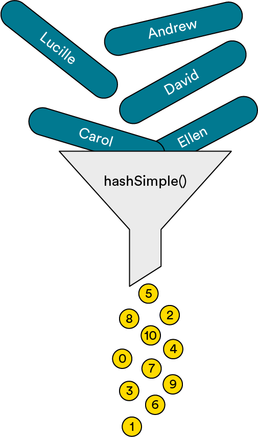

# The Function

6 of 25
The board’s function takes the resident’s first name and assigns each character an integer value: `1` for A, `2` for B, `3` for C, and so on, all the way up to `26` for Z.

Then, it adds the values for each character in the name together. And, because it needs to produce an address between `0` and `10`, it performs the modulus operation `sum % 11`. Voilà! The result is an integer address between `0` and `10`!

# And We Shall Call It: Hash

7 of 25

Because that function took something recognizable, chopped it up, and scrambled the pieces to produce an output that was wonderful (but not necessarily recognizable as the input), the board called it a hash function. Yes, kind of like when you take a potato and chop it up to make a hash brown.

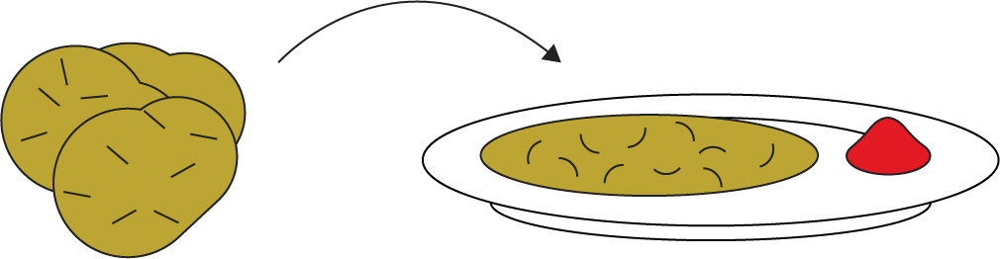

Delicious? Yes. Related to the original? Only partially.

# Hashing It output

8 of 25

The first 11 residents to sign up were April, Carol, Cary, David, Ellen, Jim, Joel, Lucille, Mary, Ruby, and Sara. Key-Value Properties ran those names through its `hashSimple()` function:

```js
((hashSimple('April') == (1 + 16 + 18 + 9 + 12) % 11) == 56 % 11) == 1;
// => April goes at 1 N. Perfect Ave
((hashSimple('Carol') == (3 + 1 + 18 + 15 + 12) % 11) == 49 % 11) == 5;
// => Carol goes at 5 N. Perfect Ave
((hashSimple('Cary') == (3 + 1 + 18 + 25) % 11) == 47 % 11) == 3;
// => Cary goes at 3 N. Perfect Ave
((hashSimple('David') == (4 + 1 + 22 + 9 + 4) % 11) == 40 % 11) == 7;
// => David goes at 7 N. Perfect Ave
((hashSimple('Ellen') == (5 + 12 + 12 + 5 + 14) % 11) == 48 % 11) == 4;
// => Ellen goes at 4 N. Perfect Ave
((hashSimple('Jim') == (10 + 9 + 13) % 11) == 32 % 11) == 10;
// => Jim goes at 10 N. Perfect Ave
((hashSimple('Joel') == (10 + 15 + 5 + 12) % 11) == 42 % 11) == 9;
// => Joel goes at 9 N. Perfect Ave
((hashSimple('Lucille') == (12 + 21 + 3 + 9 + 12 + 12 + 5) % 11) == 74 % 11) ==
  8;
// => Lucille goes at 8 N. Perfect Ave
((hashSimple('Mary') == (13 + 1 + 18 + 25) % 11) == 57 % 11) == 2;
// => Mary goes at 2 N. Perfect Ave
((hashSimple('Ruby') == (18 + 21 + 2 + 25) % 11) == 66 % 11) == 0;
// => Ruby goes at 0 N. Perfect Ave
((hashSimple('Sara') == (19 + 1 + 18 + 1) % 11) == 39 % 11) == 6;
// => Sara goes at 6 N. Perfect Ave
```

# A Perfect World on Perfect Avenue

9 of 25

The plan worked out beautifully. Everything was perfect and everyone was happy. It seemed too good to be true.

# And Then, Everything Changed

10 of 25

Then, at the end of the first lease, Jim and Carol moved in together in Carol’s house and Sara and Joel moved out, opening up houses `10`, `6`, and `9`.

The next three people on the waitlist were Andrew, Nora, and Julie:

```js
((hashSimple('Andrew') == (1 + 14 + 4 + 18 + 5 + 23) % 11) == 65 % 11) == 10;
// => Andrew goes at 10 N. Perfect Ave
((hashSimple('Nora') == (14 + 15 + 18 + 1) % 11) == 48 % 11) == 4;
// => Nora goes at 4 N. Perfect Ave
((hashSimple('Julie') == (10 + 21 + 12 + 9 + 5) % 11) == 57 % 11) == 2;
// => Julie goes at 2 N. Perfect Ave
```

As you can see, it was indeed too good to be true. It worked out OK for Andrew — he got Jim’s old bachelor pad — but not so great for Julie and Nora. There were already people living in their assigned houses!

Without thinking, a board member accidentally told Julie and Nora what their addresses would be. They were so excited to move in that they rushed across town at dangerous speeds, whipped their cars into what they thought would be their new driveways, and crashed into Ellen and Mary’s cars. Whoops!

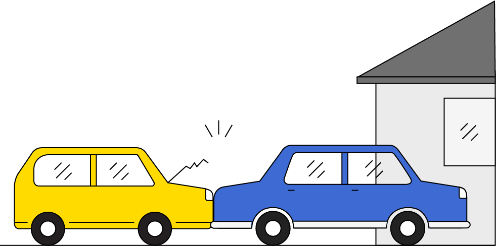

# Collisions

11 of 25

News of this spread quickly throughout the town and, from then on, everyone jokingly referred to two people coming up with the same address as **collisions**.

This was extremely embarrassing for Memoryville, so the town council told Key-Value Properties that future developments would not get any funding unless the board came up with a way to resolve these collisions.

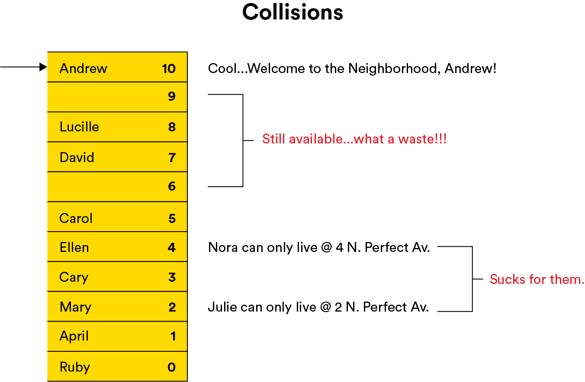

# The Second Development on Linear Lane

12 of 25

For the second development, which was built on the south side of the park on East Linear Lane, the board came up with a simple solution:

If two residents’ names generated the same integer, then it simply searched (or “probed”) through successive addresses (if the board got to `10`, it would just wrap back around to `0` and keep searching) until it found an available house. The board called this process **linear probing**, as the new development was on East Linear Lane.

# The Houses on Linear Lane

13 of 25

At the time of the ribbon cutting on the Linear Lane development, the next 11 people on the waiting list were Jean Luc, William, Data, Geordi, Worf, Deanna, Wesley, Beverly, Tasha, Guinan, and Miles:

```js
((hash('Jean-Luc') == (10 + 5 + 1 + 14 + 12 + 21 + 3) % 11) == 66 % 11) == 0;
// => Starting address for Jean-Luc is 0 E. Linear Ln.
((hash('William') == (23 + 9 + 12 + 12 + 9 + 1 + 13) % 11) == 79 % 11) == 2;
// => Starting address for William is 2 E. Linear Ln.
((hash('Data') == (4 + 1 + 20 + 1) % 11) == 26 % 11) == 4;
// => Starting address for Data is 4 E. Linear Ln.
((hash('Geordi') == (7 + 5 + 15 + 18 + 4 + 9) % 11) == 58 % 11) == 3;
// => Starting address for Geordi is 3 E. Linear Ln.
((hash('Worf') == (23 + 15 + 18 + 6) % 11) == 62 % 11) == 7;
// => Starting address for Worf is 7 E. Linear Ln.
((hash('Deanna') == (4 + 5 + 1 + 14 + 14 + 1) % 11) == 39 % 11) == 6;
// => Starting address for Deanna is 6 E. Linear Ln.
((hash('Wesley') == (23 + 5 + 19 + 12 + 5 + 25) % 11) == 89 % 11) == 1;
// => Starting address for Wesley is 1 E. Linear Ln.
```

Happily, there weren’t any collisions for the first two-thirds of the residents.

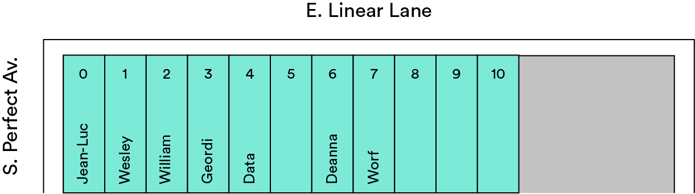

# Introducing: Linear Hash

14 of 25

Next up was Beverly:

```js
((hash('Beverly') == (2 + 5 + 22 + 5 + 18 + 12 + 25) % 11) == 89 % 11) == 1;
// => Beverly should go at 1 E. Linear Ln.
```

Well, `1` was taken by Wesley, so the board’s new and improved `linearHash()` function started with that and checked each succeeding location address until it found an empty one at `5`.

This wasn’t quite as fast as when the first several people got their houses, but after five attempts the board did find Beverly a house and, on average, was still doing pretty well.

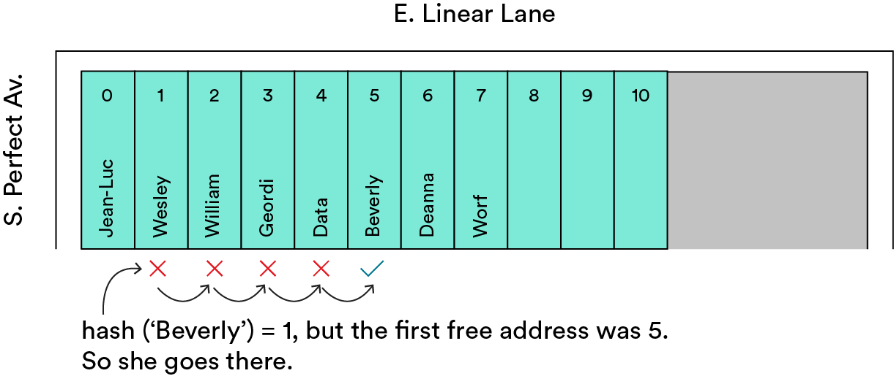

# The Rest of Linear Lane

15 of 25

Then, Tasha:

```js
((hash('Tasha') == (20 + 1 + 19 + 8 + 1) % 11) == 49 % 11) == 5;
// => Starting address for Tasha is 5 E. Linear Ln.
```

Tasha had to be moved to `8`, which took four operations. Not bad, but not great.

Next up, Guinan:

```js
((hash('Guinan') == (7 + 21 + 9 + 14 + 1 + 14) % 11) == 66 % 11) == 0;
// => Starting address for Guinan is 0 E. Linear Ln.
```

This wasn’t great either. She’d ideally get `0`, but the board had to search through each house all the way to `9`, which involved `10` checks. This was almost a worst-case scenario.

And lastly, Miles. It took eight operations to get him moved in:

```js
((hash('Miles') == (13 + 9 + 12 + 5 + 19) % 11) == 58 % 11) == 3;
// => Starting address for Miles is 3 E. Linear Ln.
```

# The Final Result

16 of 25

All in all, it took a lot of operations to get everyone moved into East Linear Lane — on average, 3.1 per resident:

`1 + 1 + 1 + 1 + 1 + 1 + 1 + 5 + 4 + 10 + 8 = 34 total operations for 11 residents`

Not quite as nice as one apiece, but much closer to one than 11, so overall a pretty solid performance.

Most of the time, Key-Value Properties was immediately able to find a house for a new resident. There were a couple of instances that presented issues but, in general, the process wasn’t too bad. And Key-Value didn’t have any more vacant houses!

# What Next?

17 of 25

Coming out of this process, the co-op board and the city council decided to meet and debrief on how it all went.

The board members kept complaining that, once the houses reached about two-thirds occupancy, the search tended to slow down noticeably. And in a statement that seemed very sensible to their theoretical minds (if a bit strange in reality), they said that the process would be much faster if the city would allow them to build 20 houses and deliberately to leave some of them empty.

The city council was a little annoyed by this request. It didn’t love the idea of building houses that would remain unoccupied, and it wanted put a library on the empty land.

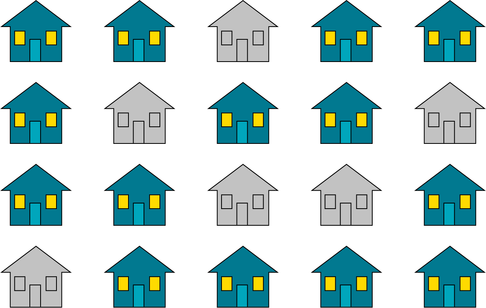

# Civic Drama

18 of 25

One city council member quipped, “Why don’t we just build a house for everyone who could ever possibly want to live here?!”

Their sarcasm was lost on some of the less-experienced (and less-jaded) computer scientists. “Wow, yeah!” they replied. “Then everyone would always be guaranteed **direct access**!”

The council got serious and, instead of agreeing to build extra houses that would only sit vacant, told the co-op board to go back to the drawing board.

Key-Value Properties had successfully secured funding for a third development: Chaining Court.

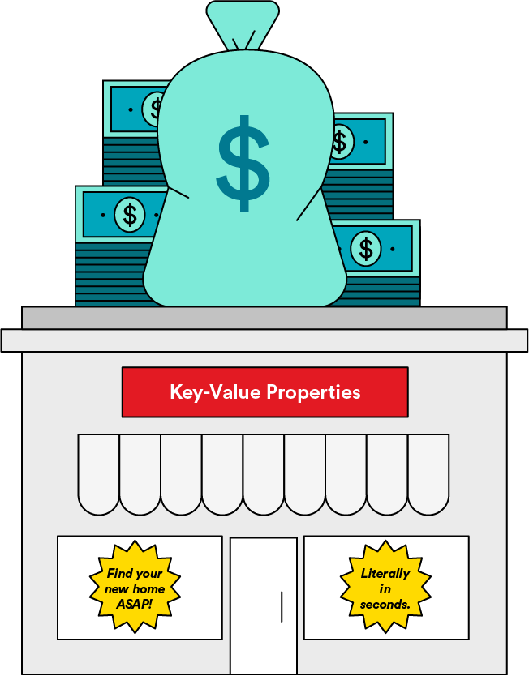

# The Chaining Court Apartments

19 of 25

With this third development on the east side of the park, Key-Value Properties tried a new approach: Instead of single-family homes, it used fancy modular loft apartment buildings that allowed for the easy addition of extra stories.

These lofts attracted a bunch of artists: Johann Sebastian, Wolfgang, Ludwig, Antonio, Frederic, Maurice, Arvo, Hildegard, Clara, Pyotr, and Igor.

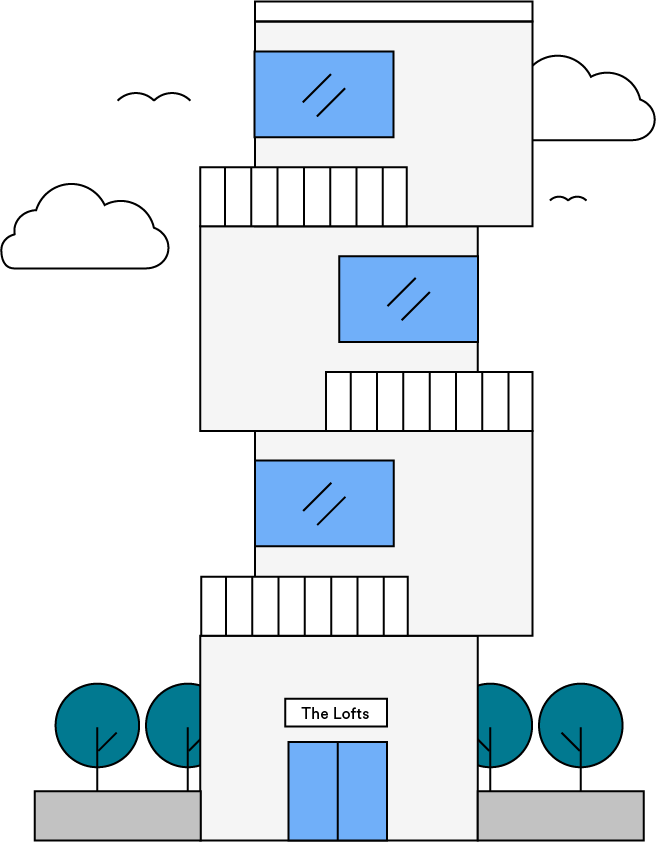

# Chaining Court Residents

20 of 25

Let’s see how their names hashed:

```js
((hash('Johann Sebastian') ==
  (10 + 15 + 8 + 1 + 14 + 14 + 19 + 5 + 2 + 1 + 19 + 20 + 9 + 1 + 14) % 11) ==
  152 % 11) ==
  9;
// => Johann Sebastian can live at 9 N. Chaining Ct.
((hash('Wolfgang') == (23 + 15 + 12 + 6 + 7 + 1 + 14 + 7) % 11) == 85 % 11) ==
  8;
// => Wolfgang can live at 8 N. Chaining Ct.
((hash('Ludwig') == (12 + 21 + 4 + 23 + 9 + 7) % 11) == 76 % 11) == 10;
// => Ludwig can live at 10 N. Chaining Ct.
((hash('Antonio') == (1 + 14 + 20 + 15 + 14 + 9 + 15) % 11) == 88 % 11) == 0;
// => Antonio can live at 0 N. Chaining Ct.
((hash('Frederic') == (6 + 18 + 5 + 4 + 5 + 18 + 9 + 3) % 11) == 68 % 11) == 2;
// => Frederic can live at 2 N. Chaining Ct.
((hash('Maurice') == (13 + 1 + 21 + 18 + 9 + 3 + 5) % 11) == 70 % 11) == 4;
// => Maurice can live at 4 N. Chaining Ct.
((hash('Arvo') == (1 + 18 + 22 + 15) % 11) == 56 % 11) == 1;
// => Arvo can live at 1 N. Chaining Ct.
((hash('Hildegard') == (8 + 9 + 12 + 4 + 5 + 7 + 1 + 18 + 4) % 11) ==
  68 % 11) ==
  2;
// => Hildegard can live at 2 N. Chaining Ct.
((hash('Clara') == (3 + 12 + 1 + 18 + 1) % 11) == 35 % 11) == 2;
// => Clara can live at 2 N. Chaining Ct.
((hash('Pyotr') == (16 + 25 + 15 + 20 + 18) % 11) == 94 % 11) == 6;
// => Pyotr can live at 6 N. Chaining Ct.
((hash('Igor') == (9 + 7 + 15 + 18) % 11) == 49 % 11) == 5;
// => Igor can live at 5 N. Chaining Ct.
```

Weirdly, it took less time to add a modular floor to the apartment buildings than to search around other locations. So, if a new resident’s name generated a repeat integer, Key-Value would simply add a floor at that address, and the problem was solved. Occasionally, a few residents would have to climb a flight or two of stairs, but seldom more. What an elegant way to resolve collisions!

# Chaining

21 of 25

Because each new floor could be added on like a link in a chain, the co-op board called this approach **chaining**. Although the city wasn’t sure about the vacant apartments at `3` and `7`, Chaining Court residents still had some land for their own sustainable micro-farms.

# The Moral of the Story

22 of 25

The residents of Memoryville lived happily ever after, pleased with their fast new hashing system. The housing crisis was solved, and people flocked back to town in droves.

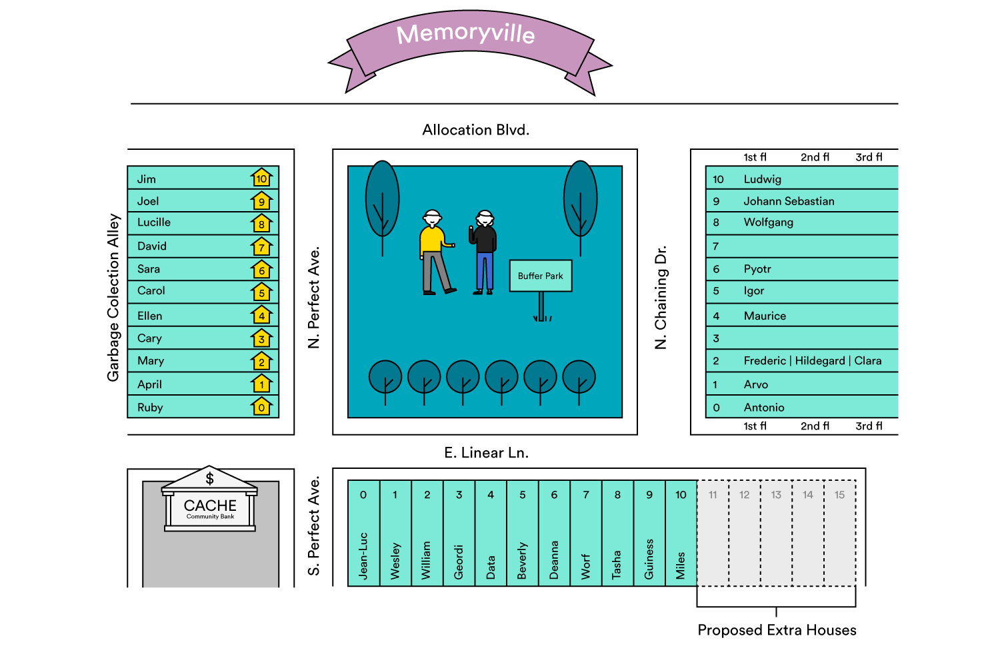

To this day, these methods are used for solving problems in computer science, where it’s particularly important that **an address in memory or index in an array be calculated quickly**.

# Wrapping Up

23 of 25

There was a lot going on in Memoryville, when it came to hash tables and hash functions! Let’s see how we can synthesize what we’ve learned.

# Knowledge Check

24 of 25

## How would you define a hash function?

### Our Answer

A hash function takes in a key, such as a string or integer, for a data record (often a key-value pair) and returns an integer memory address, or an index in a table where that record can be stored. In other words, it maps some key from the very large universe of possible keys to a much smaller range of possible indices in a hash table.

## Choose the correct definition of collisions.

- [ ] The result of a hash function crashing.
- [ ] Running two algorithms at the same time that contradict each other.
- [x] When a hash function returns the same value for two different keys.
- [ ] Movin a value to the next available index.

### Answer

Remember in our example when two residents were assigned the same address? It resulted in a collision og those values, and they had nowhere to go until the collision was resolved.

## What purpose does linear probing serve?

- [ ] Resolving collisions e rehashing a key until it matches an open index.
- [x] Resolving collisions by moving one index to the right until an pen index is found in which to store the key.
- [ ] Preventing collisions by increasing the size of the hash table.
- [ ] Preventing collisions by automatically detecting the location of open indicies

### Answer

When a collision occurs, we can find a new index using linear probing. It's the process of moving through a hash table until an open index is found.

## What is chaining?

### Our Answer

Chaining is another method of resolving collisions. Chaining means that each slot of the table can contain what is considered to be a “bucket,” which can hold more than one record. These buckets are data structures into which you can insert as many keys/records as you like.

# Introduction to Hash Tables Review

25 of 25

In the next lesson, we’ll cover the technicalities of hash tables, how to implement them, and how they appear in interviews. But, before we move on, let’s review what we learned in Memoryville:

| Concept            | Definition                                                                                | How It Appeared in Memoryville                                                            |
| ------------------ | ----------------------------------------------------------------------------------------- | ----------------------------------------------------------------------------------------- |
| **Hash table**     | A data structure that uses a key to sort an index into a table.                           | The first housing development on Perfect Avenue.                                          |
| **Hash function**  | Takes a key, scrambles it, and outputs an index to be used in a hash table.               | The method Key-Value Properties used to assign residents to houses.                       |
| **Collisions**     | When a hash function generates the same index for two different values.                   | When two residents got assigned the same house.                                           |
| **Linear probing** | A resolution for collisions that uses probing (searching for other indices in the table). | The method the development on Linear Lane used to move residents if a collision occurred. |
| **Chaining**       | A resolution for collisions that creates “chains” of other data structures at each index. | The way that residents were assigned to apartments in the Chaining Court development.     |

### TOPICS

- Hash Tables and the Hash Function
- Collisions
- Chaining
