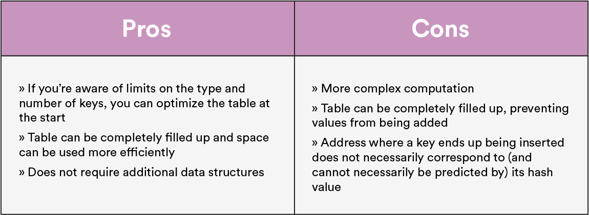
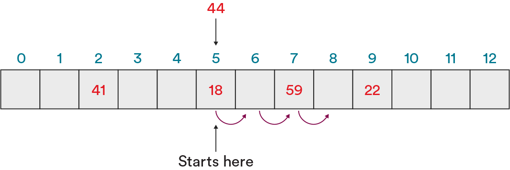
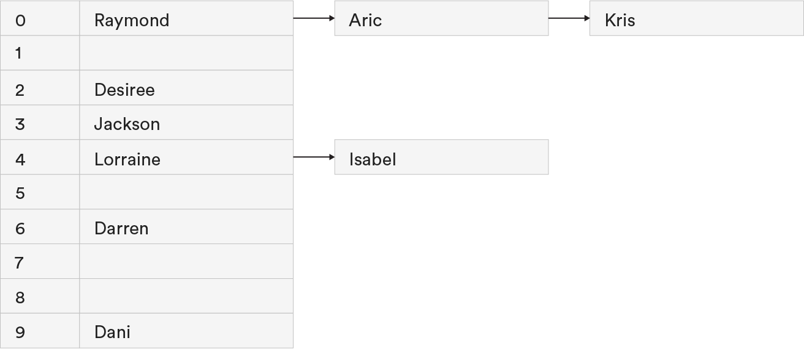
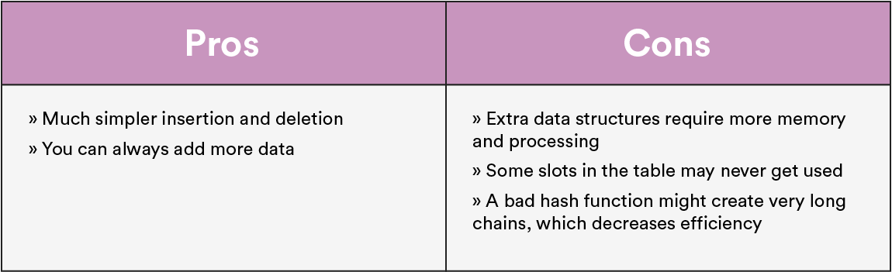
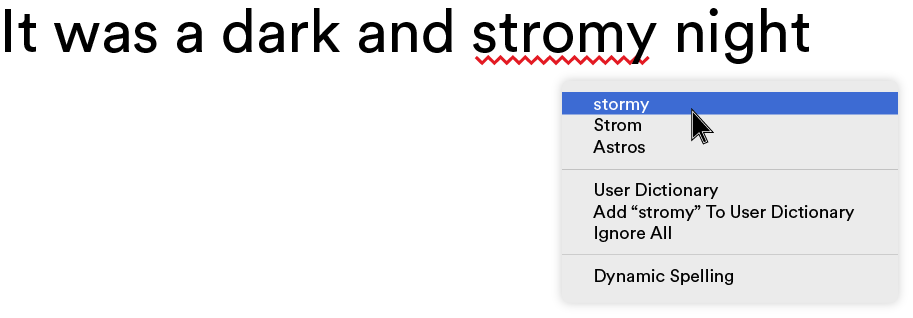

# Hash Tables Deep Dive

1 of 19

We miss our friends in Memoryville already, but it’s time to return to the real world. In this lesson, we’ll review hash tables, hash functions, and common uses of the data structure. We’ll even do some coding!

### TOPICS

- Hash Tables Recap
- Open and Closed Addressing
- Uses for Hash Tables

# Learning Objectives

2 of 19

By the end of this lesson, you'll be able to:

- Define hash tables, hash functions, and collisions.
- Explain when you would use open addressing or closed addressing to resolve collisions.
- Identify the implementations of hash tables in programming.

# Taking a Step Back

3 of 19

Before we begin, let’s define the term `hashing`. It’s a concept that appears in slightly different contexts throughout computer science, with slightly different definitions each time. But at its most basic, hashing refers to the process of taking a key (i.e., a piece of data), scrambling it with an algorithm, and producing an index that’s used to sort the key into a hash table.

A **hash function** is the algorithm that scrambles keys in order to produce indices. And, unlike the other functions we’ve learned, hash functions can take lots of different forms! There’s only one absolute rule: **For the same input, the function should always return the same output**. The rest are just general guidelines to follow when creating a hash function:

- It should be simple and efficient.
- It should distribute values evenly throughout the hash table.
- It should avoid collisions.

# Knowledge Check

4 of 19

In Memoryville, what represented the keys (input data) and the indices, respectively?

- [ ] Keys were residents'names; indicies were street adresses.
- [ ] Keys were street addresse; indicies were residents' names.
- [ ] Keys were residents' names; indices were the number of moves they had to make to find their house.
- [ ] Keys were street addresses; indices were the number of moves they had to make to find their house

<strong>ANSWER</strong>

Keys were residents'names; indicies were street adresses.

Recall that we scrambled a person's name into an integer, which was then used to assign them to a house. The name was the key (the starting value) and the address was thhe index (where the value should go.)

# But What About Hash Tables?

5 of 19

This lesson is called “Hash Tables Deep Dive,” so we should probably talk about hash tables, right?

A **hash table** is a list-like data structure that’s designed to quickly store and retrieve key data records. To store keys in a hash table, they must be mapped (with a hash function) to the set of possible indices in the table or to addresses of a memory location. In Memoryville, these were the housing developments to which we assigned residents. If we were creating a hash table with people’s names, it would look like this:

# Knowledge Check

6 of 19

You want to store a set of 100 employee records using each individual’s phone number.

Describe how you’d approach this situation using a hash function and a hash table.

<strong>ANSWER</strong>

Here’s how we broke it down:

- The phone numbers are keys, and we want to give each phone number (i.e., each employee) an index in order to sort them into the hash table.
- Create a hash function to generate an index between `0` and `99` for each phone number.
- Return the index for each phone number.
- Insert each phone number at its given index in the table.

# Where It Starts to Get Sticky

7 of 19

Remember, the one rule of a hash function is that, **for the same input, it must always generate the same output**.

However, two different inputs could have the same output — that’s not part of the rule! This is a common problem you’ll encounter in the hashing world, and it’s called a **collision**. (When Julie and Nora crashed on their way to their new houses in Memoryville, that was a collision.)

As a good programmer, you know that you need to provide a solution to collisions in your implementation. It’s your duty! There are two main methods of resolution:

- **Open addressing** (aka, probing).
- **Closed addressing** (aka, chaining).

# The Many Probing Methods of Open Addressing

8 of 19

The basic concept of open addressing: If the index generated for a key is already taken, jump to somewhere else in the table to store your key. This process is also called **probing**. The three most common types of open addressing are **linear probing**, **quadratic probing**, and **double hashing** (which we’ll get into next).

But why would we use open addressing?

# Solving Collisions With Probing

9 of 19

### Linear Probing

If the slot at the hashed index is occupied, look one slot to the right. Keep doing this until an open slot is found.

If the hash function isn’t set up carefully, this can cause what’s known as clustering, meaning that keys will be clumped together instead of distributed evenly. This is a problem, because indices are more likely to have to iterate through the cluster to reach an open space as opposed to coming across open spaces scattered neatly throughout the table.

### Quadratic Probing

If the slot at the hashed index is occupied, square the number of steps you take to the right (i.e., take one step, then four, then nine, then 16, then 25, etc.) until you find an open slot.

For example: If index `7` is taken, try `8`. If index `8` is taken, try `12`. If `12` is taken, try `21`, then `37`, and so on.

### Double Hashing

Come up with a secondary hash function. It must not ever return `0` and it must be able to return all addresses in the table.

If the slot at first index generated by `(hash(x))` is occupied, hash that index using the secondary hash function (e.g., `hash2(x))`. If that slot is occupied, try `2 * hash2(x)`, then `3 * hash2(x)`, and so on.

# Knowledge Check

10 of 19

Imagine that you are adding the name “Jackson” to this hash table. Your hash function generated the index of `4` for this key.

Using a linear probing approach, how many steps would it take to find an open index?

- [ ] 0
- [ ] 1
- [ ] 2
- [ ] 3

<strong>ANSWER</strong>

3

The next available index is `7`, so we'd have to take three steps forward in order to find this index and insert "Jackson"

# Closed Addressing (aka, Chaining)

11 of 19

The other method for resolving collisions is closed addressing, more commonly referred to as chaining. Remember the Chaining Court apartment complex in Memoryville? It was a modular building that easily allowed new floors to be added for new residents.

If we bring it back to coding, each slot in the hash table is built as a **bucket** that can hold as many keys as you want. So, if the hash function generates the same index for two keys, we don’t need to probe around to find an empty slot for them — we just add them to the bucket! Oftentimes, these buckets are implemented as a linked list: a simple data structure that preserves the simplicity of chaining. If we were to restructure our hash table of names with chaining, it might look like this:

# Chaining: Pros and Cons

12 of 19

Chaining is the more elegant and simple approach to a hash table implementation. (Ah, elegant code. We <3 you.) Let’s see why.

# Chaining vs. Probing

13 of 19

Any hash table implementation must include three basic methods:

- `search`
- `insert`
- `remove`
  The differences between chaining and probing become really clear when we look at how they each accomplish these methods. Everything is so short and clear for chaining!

| Method   | How It’s Done With Probing                                                                                                                                        | How It’s Done With Chaining                                                       |
| -------- | ----------------------------------------------------------------------------------------------------------------------------------------------------------------- | --------------------------------------------------------------------------------- |
| `search` | `hash` the key, see if it’s at that index, and probe until you find it or find an empty slot.                                                                     | `hash` the key, then search the data structure at that index for that key.        |
| `insert` | `hash` the key, then put it at the index generated; if that index is taken, probe until you find one that’s available.                                            | `hash` the key, then store it in the data structure at that index.                |
| `remove` | Essentially a `search `followed by a deletion, but you must set an indicator that an element was deleted or a probe might stop there when it should keep jumping. | `hash` a key, then delete the data from the data structure located at that index. |

# Don’t Use This: A Direct Access Table

14 of 19

A direct access table isn’t technically a hash table, but it gets lumped into this group, so let’s see why we **shouldn’t** use it.

Imagine that you have a website with 1 million users. You want to store each of them in an array with their phone number as their identifier. You know you’re going to keep adding more and more users to your website, so how big should you make the array? There are 10 digits in a phone number with 10 possible values each — that’s 10 billion possible identifiers (phone numbers) for your customers. You could set up an array with 10 billion slots; one for each possible identifier value that you’d need to slot in.

It would be so easy to find information. You’d know the exact slot where any value was stored! But obviously the size of a 10 billion-slot array is absurdly and unrealistically big. A direct access table is very **time efficient** but **extremely space inefficient**. That’s why we don’t use them — they’re a pipe dream for finding information.

# Hash Tables in Use

15 of 19

With all that’s been said about the efficiency and benefits of hash tables, let’s see how we’d actually use them! Hash tables are great in situations where we need to locate and retrieve a record in a collection of millions or billions of entries, such as accessing records in a database or locating items in a computer’s memory.

Another famous hash table you might know and love? A spell checker! As soon as a user presses the space bar, the word they type is passed through a hash function. If the function returns a key that’s in the hash table, it’s spelled correctly! If the key doesn’t exist in the table, it’s misspelled.

# Knowledge Check

16 of 19

Take a guess: What’s the worst-case time complexity for search and insertion in a hash table?

- [ ] `O(1)`
- [ ] `O(N)`
- [ ] `O(log(N))`
- [ ] `O(N^2)`

<strong>ANSWER</strong>

O(N)

In the worst case, a hash table would have to hash through every index or every element in a bucket to find a value or insert it. However, a well-written hash function can improve the efficiency to O(1) - it can go right to the appropriate index or bucket to find or insert the value!

# Let’s Talk About Interviews

17 of 19

Because hash tables are so widely used, they’re an important job interview topic. Knowing the different ways of resolving collisions and the trade-offs for each is an important place to start.

Here are some other resources to review:

- A visualization tool for [closed hashing](https://www.cs.usfca.edu/~galles/visualization/ClosedHashBucket.html) using buckets.
- A visualization tool for [open addressing hash tables](https://www.cs.usfca.edu/~galles/visualization/ClosedHash.html).
- Twenty [hashing-related questions](https://www.geeksforgeeks.org/top-20-hashing-technique-based-interview-questions/).

# Time to Practice

18 of 19

This CodePen has some pseudocode to start you off with implementing your first hash function, hash table, and basic `insert`, `delete`, and `search` methods. It also has a test script you can use to check your work!

Remember...

- Fork the Pen before making any edits.
- Don’t make any changes to the test script at the bottom.

# Hash Tables Deep Dive Review

19 of 19

Hash tables are an important concept with a lot of related vocabulary! Let’s recap:

- **Hash table:** A data structure that maps a key to an index in a table.
- **Hash function:** Takes a key, scrambles it, and outputs an index to be used in a hash table.
- **Collisions:** When a hash function generates the same index for two different values.
- **Open addressing:** A resolution for collisions that uses probing (searching for other indices in the table).
- **Closed addressing:** A resolution for collisions that creates “chains” of other data structures at each index.

### TOPICS

- Hash Tables Recap
- Open and Closed Addressing
- Uses for Hash Tables
