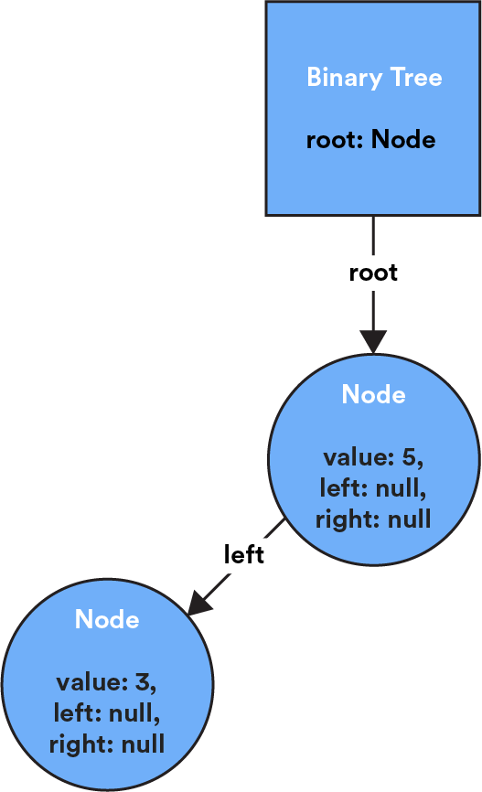
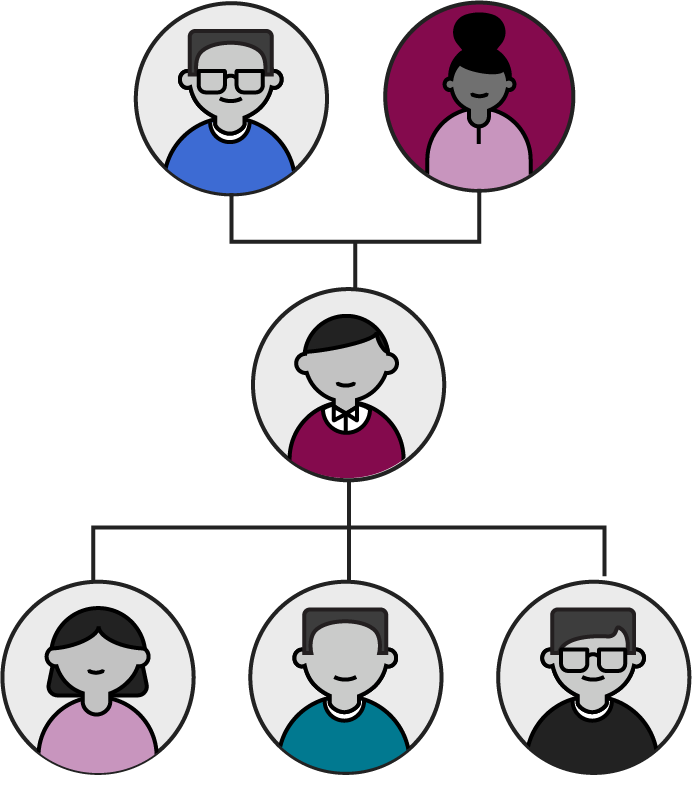
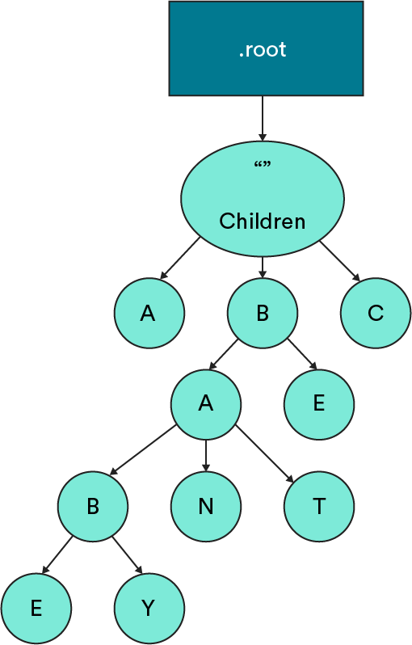
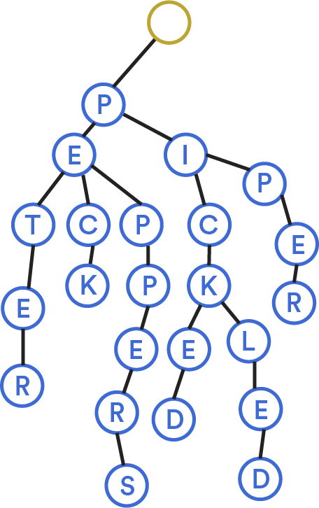
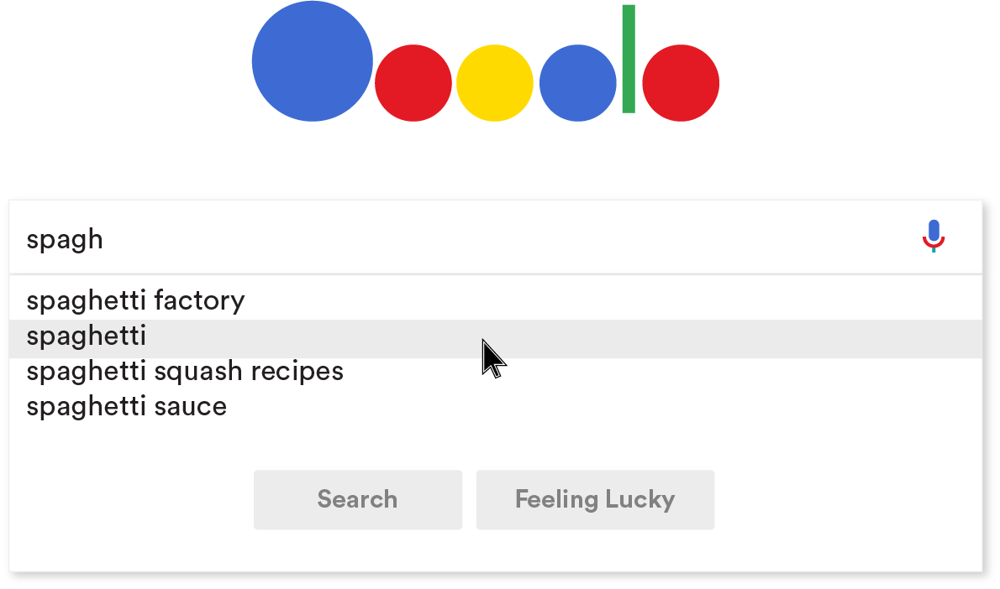
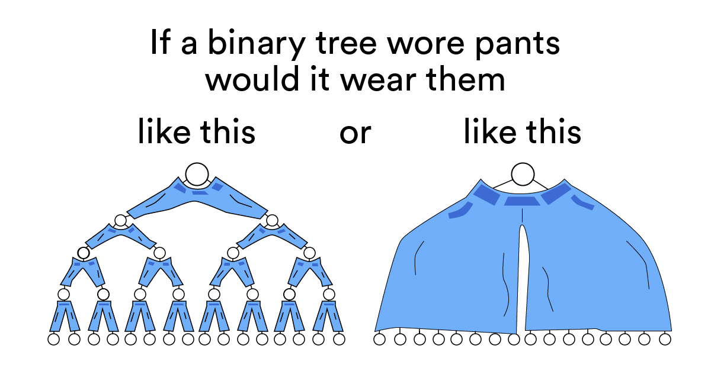

# Binary Trees and Tries

1 of 20

We’ve already learned about linked lists, a basic way to store data in nodes. Binary trees and tries are more advanced node-based structures that store data hierarchically from top to bottom (in the shape of, you guessed it, an actual tree). But here’s where we get fancy: Nodes in a binary tree or trie can point to more than one node! Let’s explore how this works.

### TOPICS

- Binary Trees
- Breadth-First and Depth-First Traversal
- Tries

# First Things First: Trees

2 of 20

Before we get into the specifics of binary trees and tries, let’s start with your basic, run-of-the-mill tree data structure.

A **tree** is a collection of **nodes** (where data is stored) and **edges** (connections between nodes). They have some characteristics that are common across all species of trees (like a binary tree or trie) and set them apart from other node-based data structures:

- Each tree has a unique start node called the **root node**. (In a strange twist of fate, roots are usually drawn at the top of the tree — go figure!)
- Each node in a tree can only have one **parent node**. This is what gives trees their hierarchical structure. There’s only ever one path from a given node back to the root.
- Edges in a tree are sometimes referred to as **branches**.
- Nodes at the end of a tree that have no child nodes are called **leaves**.
- The length of the longest path from a leaf to the root is the tree’s **height**.

Long story short: Trees are unique and awesome data structures, and programmers love analogies.

# Trees in Action

3 of 20

Trees are used in situations where data needs to be stored hierarchically, retrieved easily, and use memory efficiently. You’re probably already familiar with quite a few tree data structures:

- **Basic file storage:** Any file is stored in a directory, and that directory is stored in another directory, and that hierarchy continues laddering up to the top.
- **Comment trees:** Where users can comment on comments.
- The way that calculators compute the **order of operations**.
- The **Document Object Model** (DOM) tree.
- **Data compression algorithms**.
- **Your March Madness bracket** (or any tournament that uses a bracket elimination system).

Let’s see how Drake has used a tree data structure to store data that relied on hierarchy and organization.

# Trees in Action

4 of 20

(video)

- Transcript

At my startup where I worked, it was a big thing that we wanted to classify industries. For example, if you’re aerospace and defense. Or are you plastic injection molding? Or are you manufacturing? Or something else? We had a bunch of industries. Some of them were hierarchical with subclasses of industries. A tree data structure is really good if that’s the kind of data that you want to structure. And if you want to find the parent class of a particular industry, what are all the child classes?

Somebody who knew what they were doing — a dev, or someone with experience — built this thing out with a lot of helper functions and some other modules that we used to interface with this thing. A junior dev might reasonably be expected to manipulate it or change one of these functions that scans a tree for a particular node. Or, they need to understand how a piece of code is operating, because they’re consuming the result or they might get a subtree.

You may not be solely in charge of working with one of these things, but you’ll probably have to read, understand, and maybe tweak some code.

# Binary Trees

5 of 20

A binary tree is a species of tree with one defining feature: Each node has at most two branches.

Each node, except for the root, will have three properties:

- The `value`, which describes the data in the node.
- The `left` property, which points to a node with a lesser value than the current node.
- The `right` property, which points to a node with greater value than the current node.

The `left` and `right` properties can also be set to `null` if the node has no child elements.

As we add new nodes to the binary tree, we use this logic to find each new node’s proper place in the structure: **lesser** values go **left**; **greater** values go **right**. (Remember this hint: lesser = left!)


# Building a Binary Tree, Part 1

6 of 20

Let’s take the binary tree we started on the last slide. We've added one node with the value `5` (in actual applications, this might represent an ID in a database or a string to be alphabetically sorted).

So far, our tree looks like this in code and in a diagram:

```js
{
    root: {
        value: 5,
        left: null,
        right: null
    }
}
```

# Building a Binary Tree, Part 2

7 of 20

The process of adding a node checks the new node’s value against the existing nodes in the tree, starting with the root. So, if we add a node with value `3` to the tree below, it will go to the left of the root node, as `3` is less than `5`.

```js
{
    root: {
        value: 5,
        left: {
            value: 3,
            left: null,
            right: null
        },
        right: null
    }
}
```



# Building a Binary Tree, Part 3

8 of 20

Then, if we want to add a node with value `7` to the tree, it would go to the right of the root node, as `7` is greater than `5`.

The last node in a binary tree does not have any child nodes — it's a leaf! In this tree, both `3` and `7` would be leaf nodes, as they currently have no children.


# Knowledge Check

9 of 20

### 1

Let’s say that you wanted to add the value 9 to this binary tree. Where would it end up?

<details><summary><strong>ANSWER</strong></summary>
We'd add it to the right of 7

When we add a node to a binary tree, we start at the root and search each following node until we find a place where our value fits. Starting at the 5 node, we'd move to the right (because 9 > 5) along to the 7 node. Then, we'd add 9 to the right of 7.

</details>

### 2

Of course, we want to bring it back to Big O notation.

Take a wild guess: What’s the time complexity of adding a new node to a binary tree, given what you know about how they’re added?

<details><summary><strong>ANSWER</strong></summary>
O(N)

Since we need to traverse nodes one at a time in order to get to where we'd place the new value, our time complexity here is O(N).

</details>

# Traversing a Binary Tree

10 of 20

When you search for a node, insert a new one, or evaluate the size of a tree, you’re “traversing” it, which is just a fancy term for checking every node in a tree structure.

There are a couple of ways to accomplish this. You could do it iteratively with a `while` loop and `currentNode` pointer to move through the tree until you find what you’re looking for.

You could do it that way, but that wouldn’t be elegant code. Traversing a binary tree means moving along multiple paths in the tree. And the best method for calculating multiple paths or possibilities? Recursion, of course!

# Breadth-First vs. Depth-First Search

11 of 20

(video)

- Transcript:

There are two ways that you’ll end up traversing a binary tree — breadth-first or depth-first. They’re two different search operations that move through a tree in different ways.

In breadth-first search, we start by going wide. We visit each node that’s connected to the root node before moving down to the next level of nodes. Then, we’ll check each node connected to those nodes, move down a level, and so on. Breadth-first search tries to stay as close to the root node as possible before moving on to subsequent parts of the graph.

In depth-first search, we start by going deep. First we visit the root node, then one of its child nodes, and so on until we reach the end of the tree. We then return to the root and visit the next related node and all of the related nodes until we can’t go any further, and then circle back up. Depth-first search tries to get as far away from the starting point as possible, as soon as possible, before it hits a dead end and has to start over.

Imagine you’re playing chess and planning your next move. Do you think of all possible moves you could make next? That’s breadth-first thinking. Or, do you pick one move and figure out how far it could take you? That’s depth-first thinking.

# Which One Wins?

12 of 20

Everyone’s a winner when it comes to search methods — there’s not one that’s better than another. The search method you choose depends on the size and shape of your tree as well as the type of data you’re looking for:

| Breadth-first is better...                                                       | Depth-first is better...                                          |
| -------------------------------------------------------------------------------- | ----------------------------------------------------------------- |
| If you know the value you’re looking for is closer to the top.                   | If you know the value you’re looking for is closer to the bottom. |
| If your tree is very, very deep.                                                 | If your tree is very, very wide.                                  |
| When memory isn’t a concern.                                                     | When you need to be efficient with your memory.                   |
| When you’re trying to find the shortest path from the root node to another node. | When you’re trying to understand dependencies in the data.        |
| If you only want to use iteration.                                               | If you want to use recursion.                                     |

---

# Knowledge Check

13 of 20

Imagine that you’re searching your family tree for a certain family member. If you’re looking for someone who’s currently alive, would breadth- or depth-first search be the better option?



<details><summary><strong>ANSWER</strong></summary>
Depth-first

A living family member woulf be closer to the bottom of the family tree, meaning tht depth-first search would be much more efficient. However, if you were looking for your deceased great- great- great-grandmother, a bredth-first search would be more efficient (she's probably closer to the top of the tree).

</details>

# Time to Practice

14 of 20

Use the starter code in [this CodePen](https://codepen.io/GAmarketing/pen/jJOxBd) to take a stab at creating a binary tree, checking your work against the test script. There are several functions to implement; the `height` and `isBalanced` functions will probably be more difficult and you can consider them to be optional.

Remember:

- Fork the Pen before making any changes.
- Don’t make edits to the test script at the bottom.

# Tries

15 of 20

A **trie** (pronounced like “try” and short for “retrieval”) is a type of tree in which nodes aren’t limited to only `left` and `right` pointers. Instead, each node can store a list of “child” nodes that all represent possible paths forward through the trie.

Like a tree, a trie starts with an empty root node that points to child nodes. Each subsequent child node contains two types of data:

- A value.
- References to other nodes, usually stored in an array.

The other thing that makes tries unique? They almost always store alphabetical data. The value stored in a node is a single letter, and the references are pointers to other letters that make up a word.



# Building a Trie

16 of 20

(video)

- Transcript

Let’s say that we built a trie for the phrase, “Peter Piper picked a peck of pickled peppers.”

What if we wanted to add the word “pecked” to this trie? First, we’d check to see if the word already existed in the trie. Not there. Then, we’d follow existing nodes as far as we could go to write this word — in this case, we already have peck. To the “K” node, we’d add a reference to a new node, “E,” and then add a reference from “E” to “D.”

# Where Tries Stop

17 of 20

A trie can stop at the end of a chain if there are no more nodes for it to visit. But it can also return a word before it reaches the end; we just have to tell it where to stop.

What if we were looking for the word “pick” in the trie below? It’s there, but our current code wouldn’t know how to return it. To make the return, we’d add the `isWord` property to the “K” in “pick” so that the trie knows this is a complete word and it can return there.

`isWord` tells the trie which paths create valid words. We’d add the property to the “K” but not the “C” before it, as that’s not a valid English word.



# Tries in Action

18 of 20

Tries have some pretty cool applications. If you’ve ever started typing a search query into Google (or another search engine), you’ve probably seen it attempt to autocomplete what you’re looking for. That’s a trie in action!

Because you now know how tries work, you can probably imagine how each letter we type into a search box would retrieve a subset of a much larger trie.



Tries don’t often function on their own. They’re usually used in conjunction with another data structure or some type of search algorithm. But the trie structure is what lays the groundwork from which strings of letters can be pulled.

# Let’s Talk About Interviews

19 of 20

In an interview, you’re probably more likely to be asked about a binary tree than a trie. It could be a prompt as simple as, “Build a binary tree from this array of numbers,” which you should now be able to pass with flying colors! But binary trees can get complicated quickly. This [article](https://medium.com/techie-delight/binary-tree-interview-questions-and-practice-problems-439df7e5ea1f) outlines a number of related problems (with solutions!) that you might encounter.

You might also be asked to talk through the differences between different types of trees. This [page](https://github.com/trekhleb/javascript-algorithms/tree/master/src/data-structures/tree) outlines common characteristics of trees, as well as characteristics for several specific types of trees, including some we didn’t cover in this lesson. (Bonus: Because we didn’t cover how to implement a trie, you can read about it [here!](https://github.com/trekhleb/javascript-algorithms/tree/master/src/data-structures/trie))

Practice building a binary tree or trie with this visualization:

- [Binary tree](https://www.cs.usfca.edu/~galles/visualization/BST.html)
- [Trie](https://www.cs.usfca.edu/~galles/visualization/Trie.html)

# Binary Trees and Tries Review

20 of 20

Let’s recap on binary trees and tries.

**Trees** are an important hierarchical data structure. They’re made up of **nodes**, where data is stored, and **edges**, which represent the connections between the data.

- A **binary tree** is a tree with one unique feature: Any node can only have two branches (connections to other nodes). Nodes in a binary tree have a left property that points to a lesser value or a right property that points to a greater value.
- A **trie**is a type of tree that can only store alphabetical data. Each node stores a letter value and points forward to other nodes that make up words.

  Now that you understand binary trees, you can understand memes like this one. Lucky you!



### TOPICS

- Binary Trees
- Breadth- and Depth-First Traversal
- Tries
