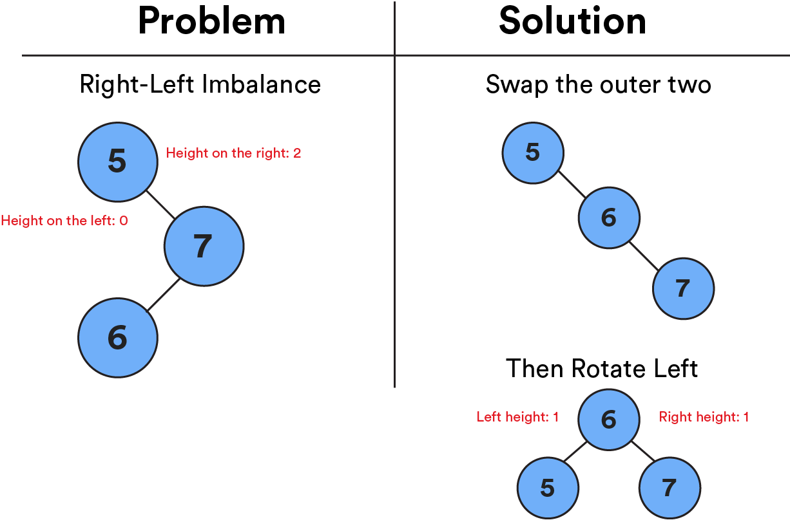

# Balancing Binary Trees

1 of 14

In our last lesson, we heard about the efficiency and power of binary trees. But, similar to us humans, binary trees are only at their best when things are balanced. In this lesson, we’ll learn about how to unlock the power of binary trees by balancing them!

### TOPICS

- Identifying Balance
- The AVL Tree

# Learning Objectives

2 of 14

By the end of this lesson, you'll be able to:

- Distinguish between a balanced and an unbalanced binary tree.
- Explain how an AVL tree balances itself.
- Balance a binary tree.

# You Hate to See That Happen

3 of 14

If we kept adding nodes to a tree that were greater than the previous node, they’d all move to the right. Eventually, this would give us a huge right side with nothing on the left. No one wants to see that happen! This tree has lost its balance.

At this point, our super-efficient binary tree is basically just a giant linked list, meaning that we’ve lost all of the efficiency gains that come along with a tree structure.


# Much Better

4 of 14

If our tree was better balanced, it would look something like this. The left and right sides are nearly the same length — as close as we can get, at least — making this tree balanced. Much better! We can now use search and insertion methods that cut the tree in half each time, getting us back to efficient `O(log(N))` complexity.

Notice how this tree became balanced. Instead of having the value `5` as the top node, we now have `7` at the top, with the other nodes in place on either side. This process of moving the nodes around on a tree until we find balance is called **rotating**.


# Finding the Balance

5 of 14

Rotating might sound great, but it’s not as simple and straightforward as it seems.

Depending on the size of the unbalanced tree, the amount of rotations required to fix it might become expensive to process. Additionally, you have to start by checking if a tree is balanced or not, which can be an expensive operation in itself.

While there are algorithms that can balance a binary tree in `O(N)` time (not too shabby), what if we told you that you could avoid the problem altogether with a binary tree that could balance itself? What a dream!

# The Self-Balancing Tree

6 of 14

We’re going to focus on one important type of tree that has realized the self-balancing dream: **an AVL tree** (named after its inventors, Adelson-Velsky and Landis).

An AVL tree balances itself by automatically calculating the difference in heights — the number of levels — between the left and right sides:

- Difference is `0` or `1`: The tree is balanced!
- Difference is more than `1`: The tree is unbalanced.
  In our balanced binary tree below, the left side has a height of `1`, while the right side has a length of `2`. The difference is only `1`, which makes it balanced!


# Knowledge Check

7 of 14

Review the following code to determine if it’s a balanced or unbalanced binary tree. (Hint: You might want to draw the tree by hand to visualize its height.)

```js
{
    "value": 4,
    "left": {
        "value": 1,
        "left": {
            "value": -2,
            "left": null,
            "right": {
                "value": 3,
                "left": null,
                "right": null
            }
        },
        "right": null
    },
    "right": {
        "value": 5,
        "left": {
            "value": 1,
            "left": null,
            "right": null
        },
        "right": {
            "value": 7,
            "left": {
                "value": -2,
                "left": null,
                "right": null
            },
            "right": {
                "value": 8,
                "left": null,
                "right": null
            }
        }
    }
}
```

<details><summary><strong>ANSWER</strong></summary>
Balanced

It's balanced! You can see that the difference in heights between the two subtrees is never greater than 1.

</details>

# Finding the Height

8 of 14

Knowing the height of an AVL tree is important — this is what allows the tree to balance itself!

In many implementations of an AVL tree, the height of a given node is stored as a property within the node itself, just like it stores `left` and `right` properties that point to its child nodes.

The height of a given node is the **longest possible path forward** in the tree before reaching a leaf node (the end of the tree). You can use the `setHeight` method to do this work for you!

# How an AVL Tree Balances Itself

9 of 14

Let’s get back to fixing the problem of balance with rotation.

Adding a new node to an AVL tree can either keep it balanced or throw it off balance. There are four scenarios for what this imbalance could look like:

- **Left-left** imbalance
- **Left-right** imbalance
- **Right-right** imbalance
- **Right-left** imbalance

These can all be resolved with rotation, but they involve different steps.

# Fixing the Imbalance

10 of 14

### Left-Left Imbalance

1. Rotate everything to the right.

   

### Left-Right Imbalance

1. Swap the outer two nodes.
2. Rotate everything to the right.

   

### Right-Right Imbalance

1. Rotate everything to the left.


### Right-Left Imbalance

1. Swap the outer two nodes.
2. Rotate everything to the left.



# Visualize It

11 of 14

Want to try your hand at balancing an AVL tree in real time? Check out [this visualization tool](https://www.cs.usfca.edu/~galles/visualization/AVLtree.html) from the University of San Francisco. You can add nodes in the “insert” input in the upper-left part of the screen and watch as the tree balances itself!

# Let’s Talk About Interviews

12 of 14

In a job interview, you may be asked to check if a binary tree is balanced or balance an unbalanced tree. (That would be a pretty hardcore interview!)

Here’s what those problems could look like:

- [Convert a normal tree to a balanced one](https://www.geeksforgeeks.org/convert-normal-bst-balanced-bst/).
- [Determine if a binary tree is balanced](https://www.geeksforgeeks.org/how-to-determine-if-a-binary-tree-is-balanced/).
- [Whiteboard an AVL tree](https://www.youtube.com/watch?v=rbg7Qf8GkQ4).

# Time to Practice

13 of 14

Let’s balance some trees! [This CodePen](https://codepen.io/GAmarketing/pen/bZGMaQ?editors=0010#0) has some pseudocode to get you started with implementing an AVL tree. This is a tricky exercise — get as far as you can and use the test scripts to check your work.

Remember:

- Fork the Pen before editing it.
- Don’t change the test scripts at the bottom.

# Balancing Binary Trees Review

14 of 14

Let’s review what we’ve learned:

- When we add nodes to a binary tree, we run the risk of it becoming **unbalanced** (i.e., one side being longer than the other). This makes the tree inefficient. Sad.
- We can rebalance a binary tree by **rotating** its nodes, but this can be inefficient. Meh.
- Enter the **AVL tree**: a self-balancing tree that adds nodes efficiently so that it doesn’t become unbalanced. Plus, we get back our efficiency. Hooray!

### TOPICS

- Identifying Balance
- The AVL Tree
