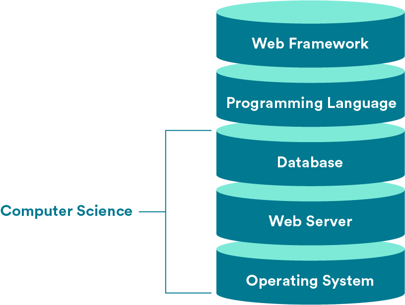
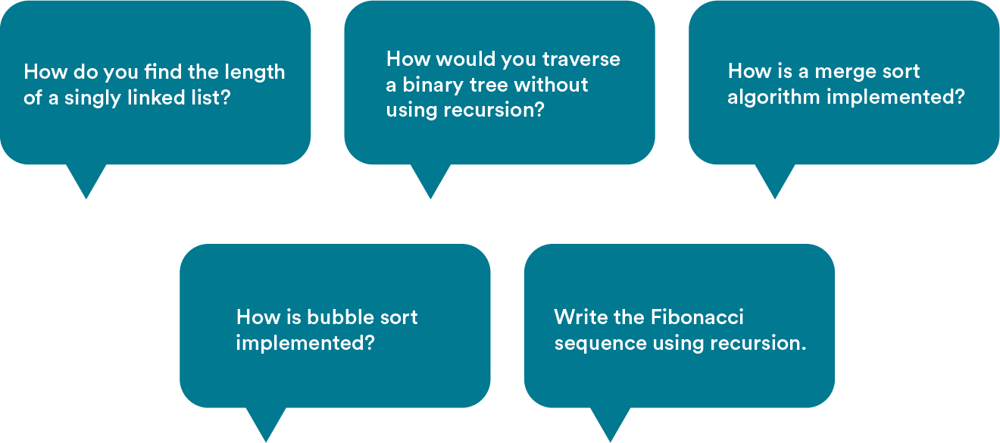

# Learning Objectives

By the end of this lesson, you'll be able to:

- Define computer science.
- Explain why understanding computer science can make you a better programmer.
- Describe how computer science appears in software engineering job interviews.

# Defining Computer Science

It’s a bit unfortunate that computer science has the word “computer” in its name, because it has many applications beyond just what we think of as a “computer.”

Instead, think of computer science as the study of the nature of computation; in other words, the study of problems, standardized solutions to those problems, and how to make those solutions more efficient.

# Layers of Abstraction

Computer science is, by definition, an abstract field of study.

Does “abstraction” feel like an abstract concept? Think about it this way: When you drive a car, you’re putting your key in the ignition, using the accelerator and brake pedals, and monitoring the speed and fuel gauges so that it runs. You’re dealing with the car’s operating system in the abstract, using tools that its manufacturers designed to make driving simple and easy.

On the other hand, the mechanic who works on your car has to understand how the ignition connects to the engine, how the pedals actually make the car move, and everything else that happens “under the hood.” The mechanic is cutting through layers of abstraction to get down to the car’s physical operations.

# In Programming Terms...

The way that most people use computers — sending emails, browsing websites, creating documents — is like sitting in the driver’s seat of a car. Even writing code and building web applications is similarly abstract. You’re using functions, tools, and languages created by other engineers to make cool stuff.

Computer science studies all of the “under the hood” mechanics of computers that most people don’t think about. What actually is a programming language? Isn’t it crazy that they can be read across so many different machines? And how do you get from binary 0s and 1s to what you see on your screen?

In computer science, we’re cutting through those layers of abstraction down to how stuff really works.

# Finding Yourself in CS

At this point, you might be wondering, “Where does computer science fit in with what I know about web development?”

We’ll be straight with you: Computer science deals mostly with parts of the tech stack you may not be interacting with all that much. Most of the programming you’re doing — building applications and websites that users interact with — sits at higher levels in the stack.

But computer science comes into play much lower in the stack, when you’re thinking about interactions between a database, a server, and your operating system.

# What’s In It For Me?

So, if you most likely won’t be working with computer science concepts all that much, why should you learn about them?

It’s a legitimate question! From our perspective, there are two vitally important reasons to learn (at least a bit) about computer science:

- It makes you a more well-rounded software engineer.
  -It comes up all the time in technical job interviews.

# Let’s Talk About Interviews

You may have already heard stories of the infamous whiteboarding components of engineering job interviews, where you’re given a question and asked to draw out a solution on the spot. Oftentimes, those questions relate to computer science. If just reading this sentence strikes fear in your heart, you’re not alone.

Here are the sorts of CS questions you might encounter in a job interview. (Spoiler alert: You may not know what all of these questions are about, but by the end of this computer science unit, you will!)

# Why CS?

The fundamentals of computer science are a popular interview topic for a couple of reasons:

- They show that you know and care about the world of programming.
- They’re a great way for interviewers to understand how you approach a problem.

Let's hear about what interviewers are looking for when they ask candidates about computer science.

# No Code Allowed

Luckily for you, prepping for computer science interview questions doesn’t require memorizing long lines of code. As some of the instructors mentioned, you’ll typically be expected to draw out your approach to a problem on a whiteboard.

A lot of algorithms and data structures can easily be explained visually without any code. You’ll need to understand how they work on a conceptual level in order to successfully answer these interview questions.

The best part? Whiteboarding is easy to practice and learn!

# Looking Ahead

Computer science is a vast discipline that covers topics ranging from the theory of programming languages to computer system architecture. It would be impossible to cover all of it here!

Instead, we’ll focus on the principles of computing — in other words, how computers approach and solve problems. The two important factors here are:

- Algorithms, or step-by-step processes for solving a problem.
- Data structures, or the way that information is organized in order to solve a problem.

Algorithms and data structures are two areas of computer science that come up frequently in technical interviews. The concepts we’ll cover here are ones that you may be asked to think through and whiteboard out.
